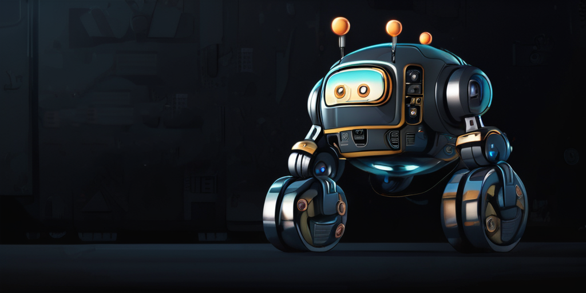

<p align="center"><strong>vulcan-robot-architecture-doc</strong></p>
<p align="center"><a href="https://github.com/DDTRobot/diablo_sdk_v2/blob/main/LICENSE"></a>


</p>
<p align="center">
    语言：<a href="./md"><strong>English</strong></a> / <strong>中文</strong>
</p>

---



## Installation 安装

| Installation method | Supported platform[s] |                       Development Docs                       |
| :-----------------: | :-------------------: | :----------------------------------------------------------: |
|       Source        |  Linux , ros-humble   | [ROS2 机器人开发框架](https://vulcan-robot-architecture-doc.readthedocs.io/zh-cn/latest/index.html) |

```warning
	莫在浮沙铸高塔！！！
```

