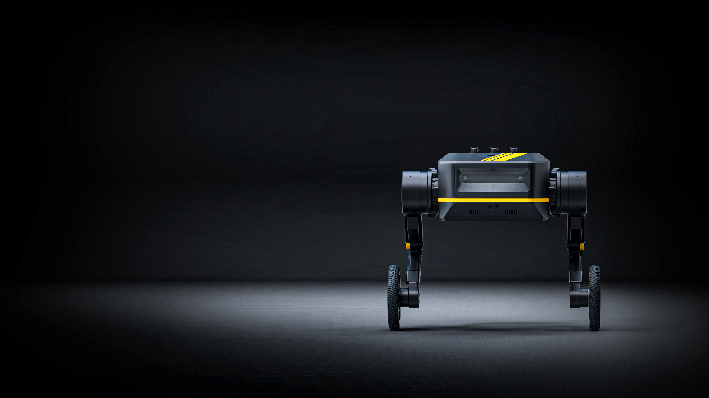

> # Welcome to TITA-Robot Documentation!

```{toctree}
:maxdepth: 1
pages/Robot-API
pages/Robot-Controller
pages/TITA-Tower
pages/ubuntu-flash
pages/quickstart
```

## 简介

TITA是本末科技有限公司研发的第二代双轮足机器人，拥有8DoF自由度，TITA机器人是一款具备高度感知力和决策力的准直驱型轮足机器人，将轮式机器人的速度和敏捷性与足式机器人的强适应性完美结合。同时其采用模块化结构及开放式接口，可搭载视觉模块、通讯模块、Al主机、边缘处理器和各种传感器，可应用于智慧园区、矿山及各种复杂的工业环境中，执行高效率巡检、负载运输、数据采集、扫描测绘等任务。



### 致谢
非常感谢您选择我们的产品，我们承诺将为您提供最优质的产品和服务。您的满意是我们最大的追求。如果您在使用过程中有任何问题或需要帮助，请随时联系我们，我们将竭诚为您服务。再次感谢您的信任和支持！

快速上手请跳转[Quick Start](https://tita-development-manual-uc.readthedocs.io/zh-cn/latest/pages/quickstart.html)

