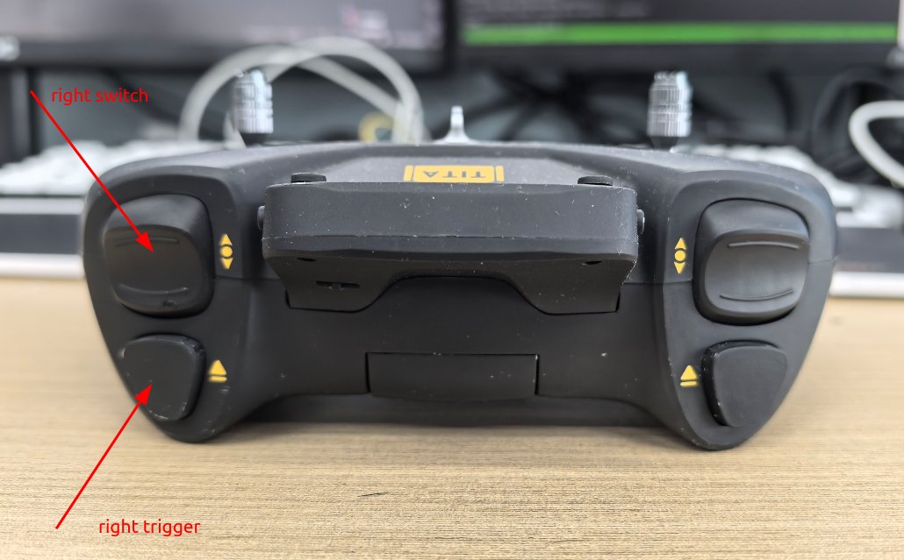
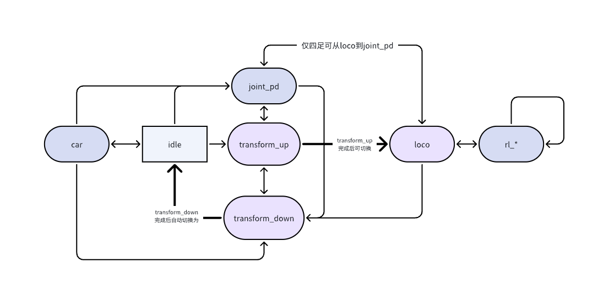
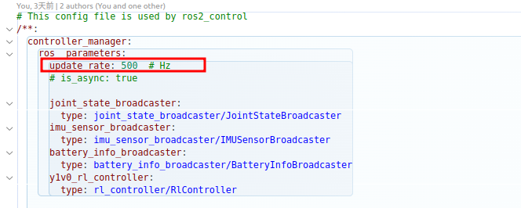

# 遥控器模块
```{toctree}
:maxdepth: 1
:glob:
```
------





## 常用组合

### 双轮足模式(默认)

| 模式选择(mode) | 启动按键 | 三级开关(左) | 三级开关(右) | 描述       | 左摇杆     | 右摇杆             |
| -------------- | -------- | ------------ | ------------ | ---------- | ---------- | ------------------ |
| 不选           | 按下     | 中           | 任意         | 高度调节   | 前进及转弯 | 前推升高、后推降低 |
| 不选           | 按下     | 上           | 上           | 俯仰调节   | 前进及转弯 | 前推抬头、后推低头 |
| 03 (skill 1)   | 按下     | 中           | 任意         | RL平地模式 | 前进及转弯 | 侧走               |
| 04 (skill 2)   | 按下     | 中           | 任意         | RL上楼梯模式 | 前进及转弯 | 无效               |
| 06 (crawl mode) | 弹起     | 任意         | 任意         | 车模式     | 前进及转弯 | 无效               |

### 四轮足模式（默认）

| 模式选择(mode) | 跳跃按键 | 三级开关(左) | 三级开关(右) | 描述         | 左摇杆     | 右摇杆   |
| -------------- | -------- | ------------ | ------------ | ------------ | ---------- | -------- |
| 不选           | 弹起     | 中           | 任意         | RL平地模式   | 前进及转弯 | 侧走     |
| 03 (skill 1)   | 弹起     | 中           | 任意         | RL上楼模式   | 前进及转弯 | 侧走     |
| 04 (skill 2)   | 弹起     | 中           | 任意         | RL 高台模式  | 前进及转弯 | 无效     |
| 05 (skill 3)   | 弹起     | 中           | 任意         | 回旋         | 转弯       | 无效     |
| 不选           | 按下     | 中           | 任意         | 旋转跳跃模式 | 无效       | 无效     |


## **[遥控器配对](how-to-pair.md)**

### 状态机
控制器内部状态机流转如下图所示，箭头方向表示可从A状态切换到B状态，四足控制无car状态机。部分在菜单内显示的状态机星号表示处于当前状态机（03到07）。



### 遥控器菜单页
1、进入菜单页

- 按下右侧按键进入菜单页，如下图：


进入菜单,界面如上, 功能分别为:
- 01 切换四足模式（本质为上述*.service切换）
- 02 解锁拼接机构（先切换为双轮足后解锁）
- 03 强化控制策略1(双轮足侧走/四轮足爬楼梯)
- 04 强化控制策略2(双轮足爬台阶/四轮足爬高台)
- 05 强化控制策略3(未启用)
- 06 匍匐模式(双轮足启用)
- 07 锁定关节
- 08 joystick sdk mode，关闭ros2 command话题发布

### 解锁/拼接切换

1. 拼接：
  - 趴着拼接：保持主机遥控器`left_button`弹起，`left_switch`扳下，连接器拼上后，主从机器上拼接状态灯均显示为蓝灯，进入菜单点按`01 Quadruped Mode`后等待机器切换状态，拼接成功后`01 Quadruped Mode`前标记星号*，机器进入到idle状态。
  - 站着拼接：保持主机遥控器`left_button`按下，`left_switch`扳中，连接器拼上后，主从机器上拼接状态灯均显示为蓝灯，进入菜单点按`01 Quadruped Mode`后等待机器切换状态，拼接成功后`01 Quadruped Mode`前标记星号*，机器进入到loco状态。
2. 分离：
  - 趴着分离：保持主机遥控器`left_button`弹起，`left_switch`扳下，进入菜单点按`02 Unlock Bolt`后等待机器切换状态，正常工作时拼接机构会有解锁声音。结构解锁开后02 Unlock Bolt前*消失。若从四足状态分离，同时双机均进入到`06 Crawl Mode。`若两机均处于双足状态分离，两机均保持当前的状态机（当前是06 Crawl Mode就是06 Crawl Mode，若是idle那就是idle）。
  - 站着分离：保持主机遥控器`left_button`按下，`left_switch`扳中，进入菜单点按`02 Unlock Bolt`后等待机器切换状态，正常工作时拼接机构会有解锁声音。结构解锁开后`02 Unlock Bolt`前*消失。
  - 分离后，从机会按照当前遥控器状态切换状态（若遥控器未开机，则无状态切换，但如果从机启动了遥控器断连检测，会趴下）。


### 配置修改

#### 遥控器 

基于ROS2框架，修改对应文件来下的yaml文件来配置，下述为遥控器一些相关配置：
```{Markdown}
  teleop_command:
    ros__parameters:
      can_interface: vcan0
      net_interface: wlan0 
      uart_interface: /dev/ttyUSB0
      update_rate: 10 # Hz
      use_sdk: false # 默认是否启动joystick的sdk模式，默认false不启动
      enable_low_battery_check: false # 低电量，电量低机器会趴下，true为启动
      battery_percentage_threshold: 0.1 # 阈值，当电量低于此值进入到低电量状态，
      enable_joystick_disconnect_check: false # 遥控器断连检测，断连后机器会趴下，true为启动
      joystick_disconnect_time_threshold: 1.0 # 检测时间，超出此时间，遥控器断连
      joystick_deadzone: 0.013
      speed_ratio: [0.33, 0.66, 1.0]
      max_twist_linear: 3.0
      max_twist_angular: 6.0
      max_roll: 0.2
      max_pitch: 0.4
```
### 运动控制

- 修改控制频率
`vim /opt/y1_ros2/share/rl_controller/config/y1v0/controllers.yaml` 修改四轮足
`vim /opt/y1_ros2/share/rl_controller/config/y1v0h_evt1/controllers.yaml` 修改双轮足
查找对应`update_rate`字段，修改对应控制器中`update_rate`整形值（控制频率，Hz）目前默认为500Hz。修改`controller_manager`和`*_rl_controller`）下的update_rate后重启即可。



### ERROR_CODE 

#### 电机错误码

错误码格式：

- 主机0x100 + 电机编号（12345678,只显示掉线最小标号的电机）， 0x100代表主机MCU自检失败。
- 从机0x110 + 电机编号（12345678,只显示掉线最小标号的电机）， 0x110代表从机MCU自检失败。

```{note}
0x表示16进制
```