# D1 各模块OTA

```{toctree}
:maxdepth: 1
:glob:
```

------

本章节介绍D1各模块OTA升级方法。

## 一、Y1-ros2
1. 升级前请先确认机器人运行正常，并确认机器人处于趴下状态。
```bash 

sudo apt install ./y1-ros2_xxxxx_arm.deb

sudo apt update #若安装.deb包失败，请执行此命令,再重新安装.deb包

# 卸载旧版
sudo dpkg --purge y1-ros2
sudo rm -rf /opt/y1_ros2

#版本检查

dpkg -l y1-ros2

```

## 二、MCU模块OTA

由于MCU模块OTA升级需要使用到OTA升级工具，请先下载OTA升级工具。

```bash 
sudo apt update
sudo apt-get install motor-upgrade

#注意电脑中是否安装python3-pip 依赖，若无需安装

# 升级MCU模块固件 and 电机固件 指令

otafifth_demo -f $BIN_PATH

# 升级完成后可查询MCU版本
can-app -Version


```
```{note}
请注意！为保证升级正常,请先确定机器人运行正常(8个电机都通讯正常),并将机器调为趴下状态。
```


## 三、系统刷机升级

## 注意事项
1. 请仔细阅读使用须知即刷机文档。如开始进行刷机，即视为已阅读下述须知。
2. 该系统的刷机是不可逆的过程，本质上是将系统恢复出厂状态，注意个人数据进行备份。
3. 刷机过程中请勿进行任何操作，请勿断电。


## 准备工作
刷机工具：**Ubuntu22.04系统电脑**
硬件准备：D1随包装的刷机线（标志A朝外插入DBG口，先插线再上电）；
此操作需要将刷机包下载至电脑（必须Linux系统）中，并创建新的文件夹，将刷机包解压至新建的文件夹中。

```bash
# in ubuntu22.04 host computer
sudo apt install abootimg binfmt-support binutils cpio cpp device-tree-compiler dosfstools
        lbzip2 libxml2-utils nfs-kernel-server openssl python3-yaml qemu-user-static
        sshpass udev uuid-runtime whois rsync zstd lz4
# 全部复制，这是NVIDIA刷机所需要的依赖，请首先将以上依赖安装在刷机的电脑中，而不是机器人
```
1. Download apollo-ubuntu-${date}.tar （下载对应日期的系统软件包；目前最新系统包可找我司FAE同事获取)
2. mkdir apollo-ubuntu（可在电脑系统的任意位置创建文件夹）
3. tar -xf apollo-ubuntu-${date}.tar -C apollo-ubuntu （解压系统软件包至新建文件夹中）

### 开始刷机
进入刚刚创建的文件夹
1. cd  apollo-ubuntu
2. sudo ./flash_robot.sh
注意！部分Ubuntu中可能缺少sshpass和nfs-kernel-server两个插件，缺哪个装哪个
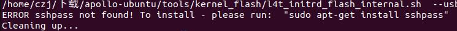
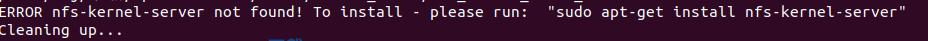

### 结束标志
刷机完成时可以看到以下信息
```{bash}
1. Flash is successful
2. Reboot device
3. Cleaning up...
4. Log is saved to Linux_for_Tegra/initrdlog/flash_3-1_0_20240821-140503.log
``` 
并且输入指令`lsusb`能看到这个信息
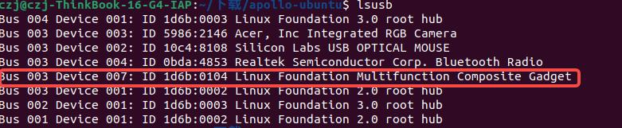


## 遥控器固件升级

**工具准备**： windows系统（11以上）、USB-C数据线
### 操作步骤
#### 1.使手柄进入固件更新模式
（1） 同时按下以下两个地方的按钮，如图
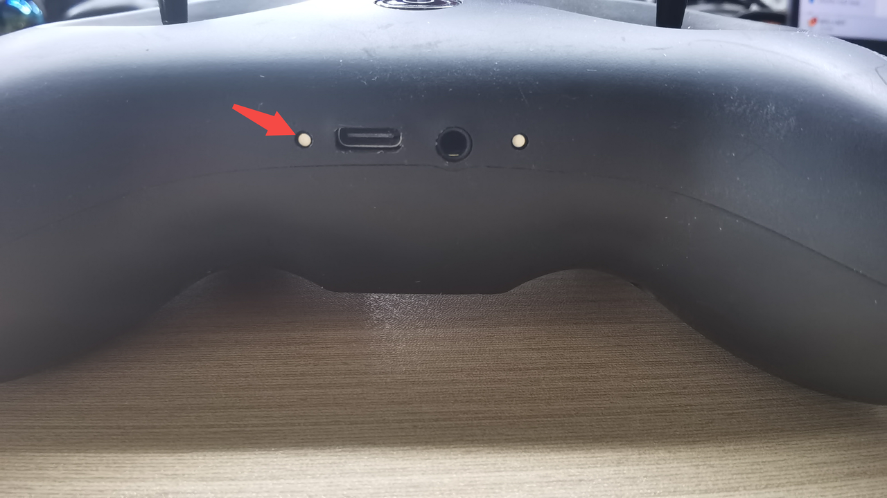
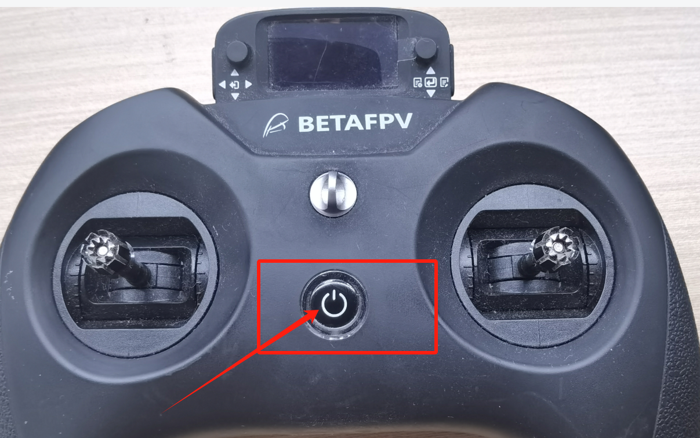
（2）按下按钮后会进入如图界面，即成功进入固件更新模式
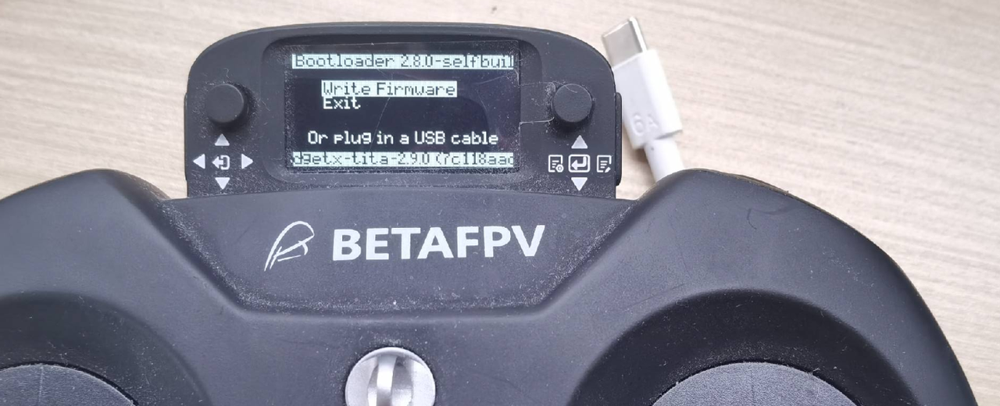
#### 2.开始更新
（1）使用USB-C数据线连接手柄与电脑，电脑会弹出U盘界面（该界面是手柄内置存储器的界面）
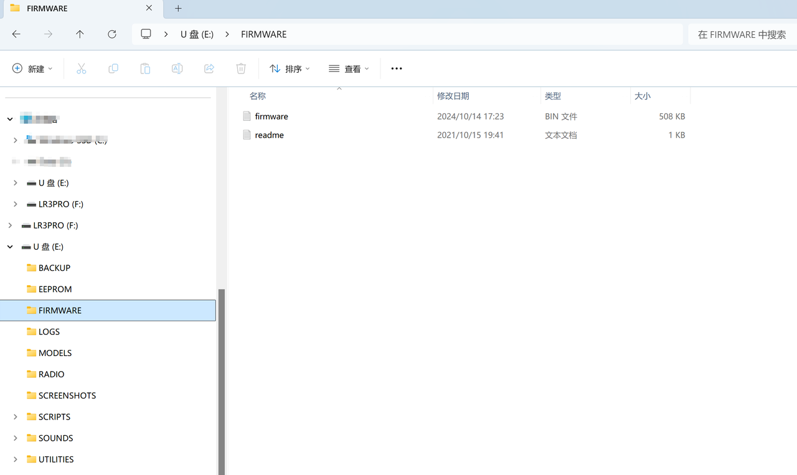
（2）将最新的`firmware.bin`放到`FIRMWARE`目录下，如上图所示。（Ps.若没有手柄固件或最新固件的用户可联系我司售后工程师索要。）  
（3）将USB-C数据线与手柄断开，按下右边按钮，一直按着直到手柄界面出现**writing**的界面，即在烧写固件中。随即请耐心等待其烧写完毕出现**Writing Complete**的界面。如图
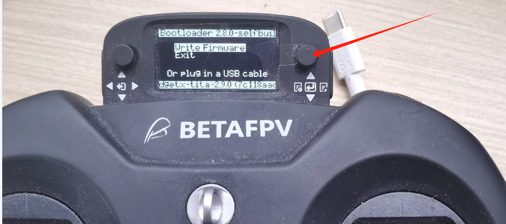
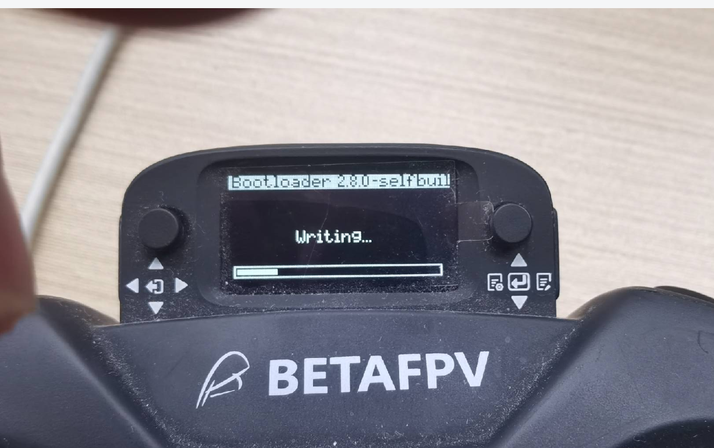
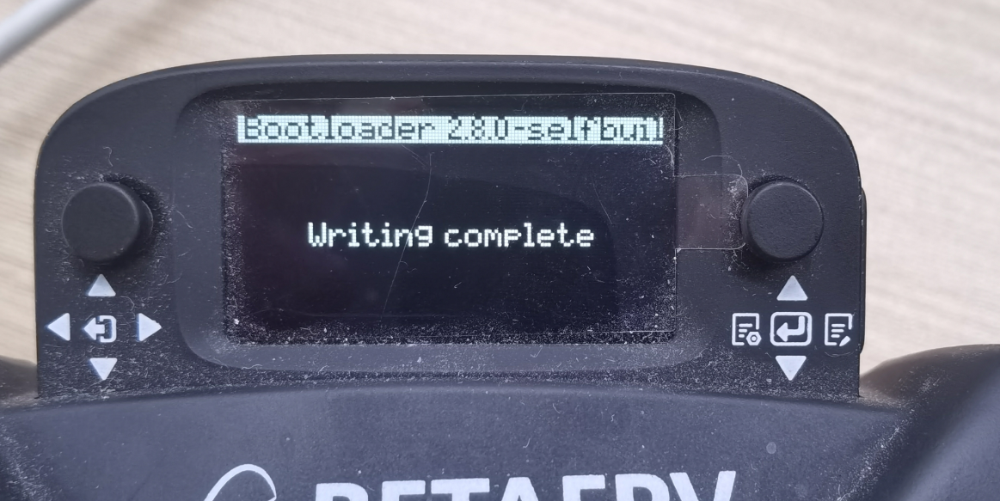
（4）随后按下开关机键重启手柄，按下右边按钮，朝中间按下，会出现`mode select`界面
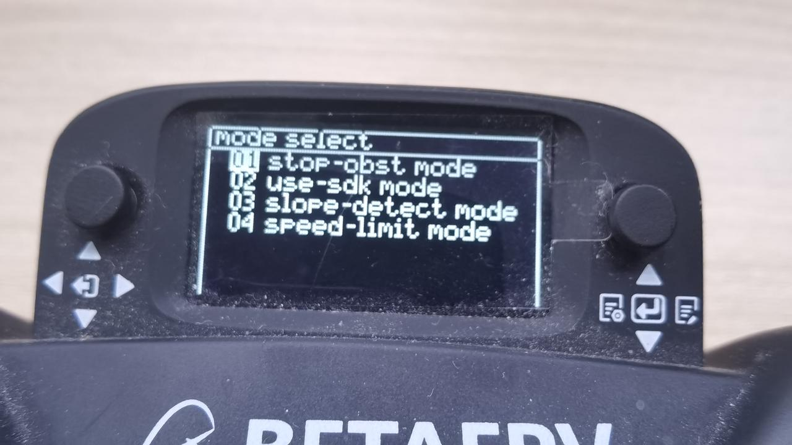
#### 3.更新接收机
完成以上步骤就是完成了第一阶段固件更新！  
接下来就是更新接收机的时候。  
（1）首先遥控器开机后，右边按键向左推进入界面后 按键依次进入Tools ->ExpressLRS->wifi connectiving->Enable wifi
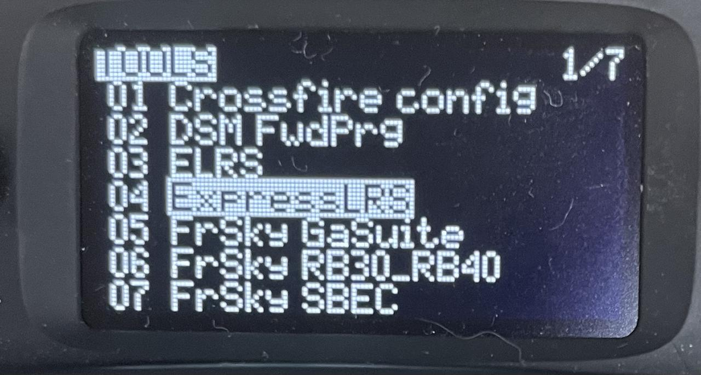
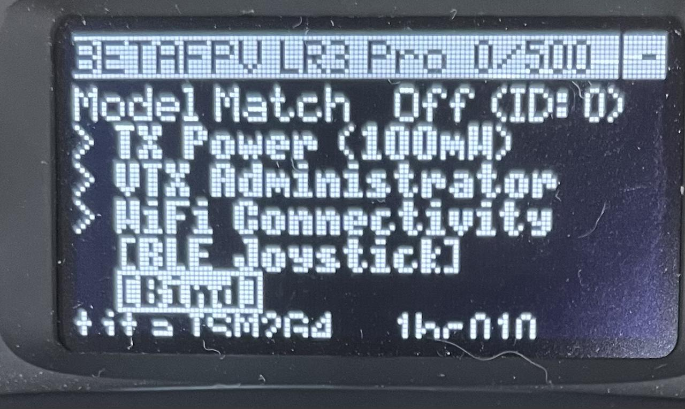
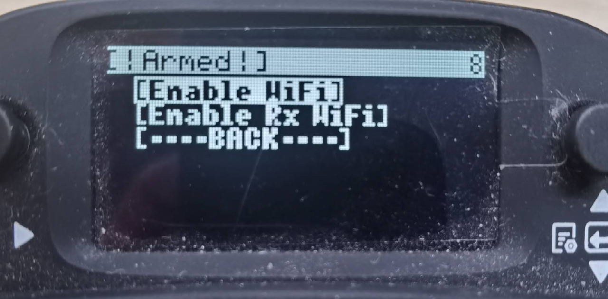
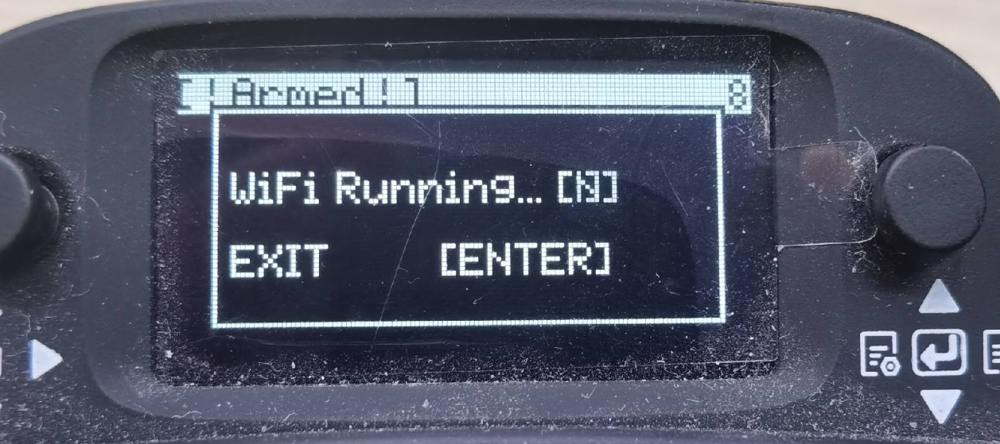
（2）电脑连接wifi ,wif账号：ExpressLRS  TX     密码为：expresslrs
连接WIFI后，浏览器会弹出update Web端，如果弹不出，手动输入10.0.0.1,同时确保wifi正常连接
并选择要更新文件
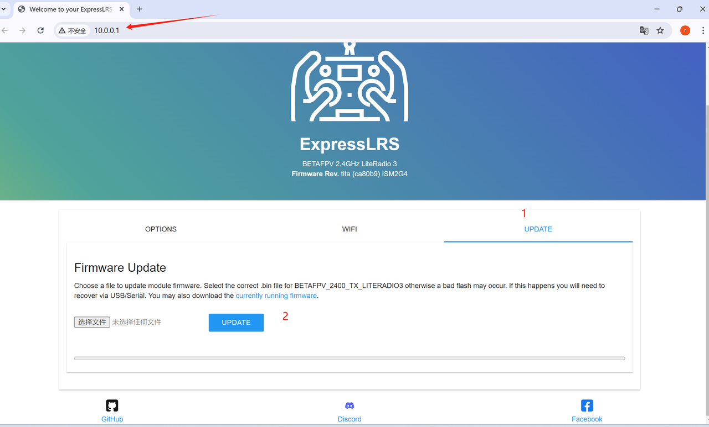
（3）点击UPDATE, 如果更新不成功，如上图，先更新第一文件夹的模块
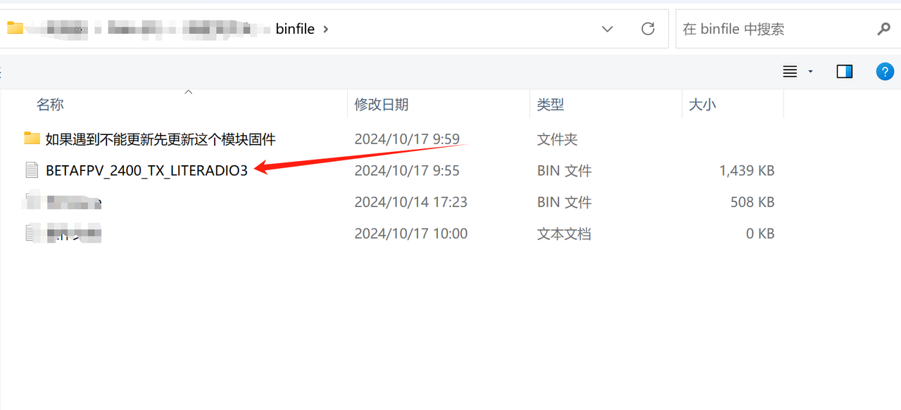
（4）更新成功会有如图界面
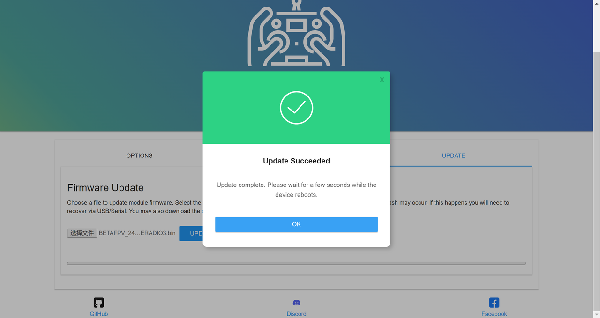
（5）完成以上步骤完后，重启手柄，配置遥控器控制速率，右边按键向左推进入界面后 按键依次进入Tools ->ExpressLRS->Telem Ratio  1:128 (按下选中，出现闪烁，说明选中)，如图
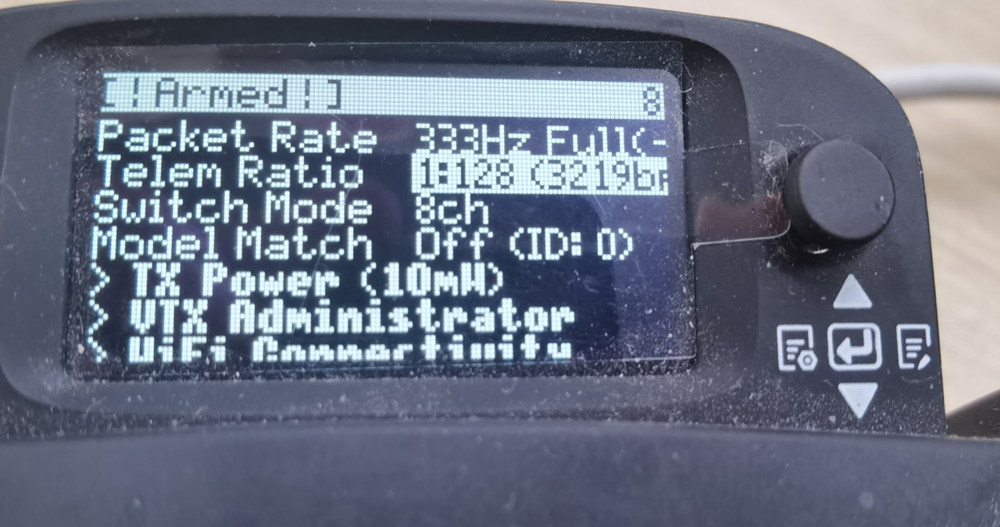
（6）向下推，至1：8，按下中间确定，配置完成！
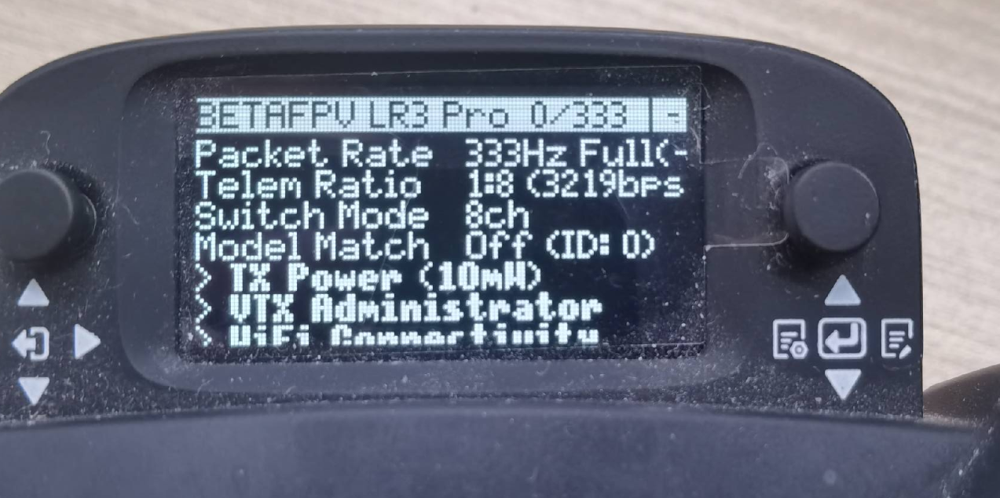
至此手柄固件已全部升级完成！！