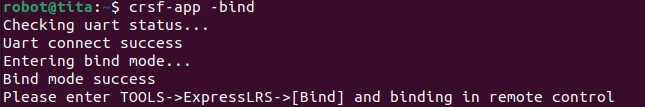
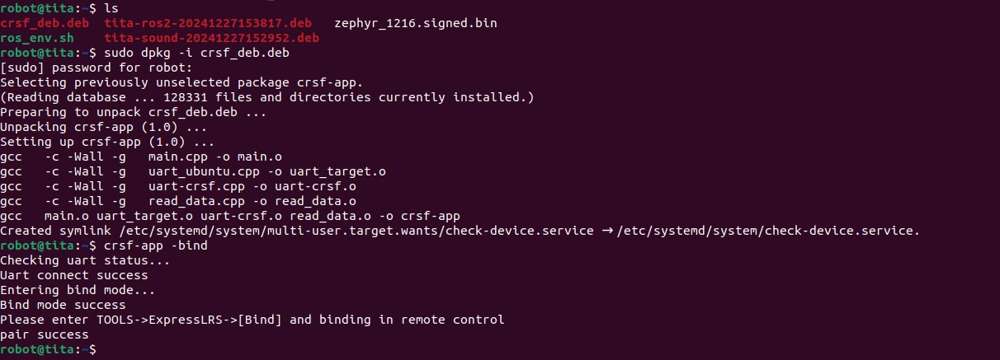

# 遥控手柄配对指南

```{toctree}
:maxdepth: 1
:glob:
```

------
（在机器人上执行此操作）最新的机器人系统现在配备了内置的遥控配对软件，有两种快速配对遥控器的方法。
```{note}
对于较旧的系统版本，您可以联系FAE获取远程控制配对软件的安装包。
```
## 方法一
1. 使用`sudo dpkg -i crsf_deb.deb`（如果已经包含或已安装，请跳过此步骤。）
2. 执行指令`crsf-app -bind`，可以观察到返回：

6. 遥控器开机后 右边按键向左推进入界面后 按键依次进入Tools ->ExpressLRS-> bind模式，进行配对接收机.
 
 
7. 配对完成返回pair success


