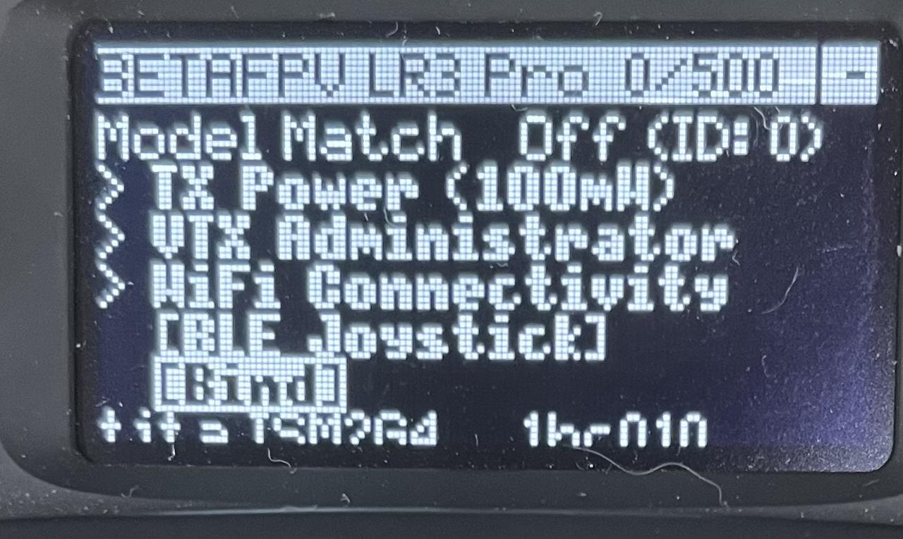

# Robot Controller Pairing

```{toctree}
:maxdepth: 1
:glob:
```

------
This manual is for teaching the pairing of the robot controller with the robo

## Pairing Steps
```{note}
Pairing the remote control requires connecting to a terminal.
ssh root@192.168.55.1
Debug wire have to connect DBG count and  face A should be facing outwards
```
1. Terminal execute command `crsf-app -bind` ，will back：
    ```
    正在检查串口通讯状态...
    uart connect success
    正在进入配对模式...
    bind mode success
    请打开遥控器，左长按右侧按键进入`TOOLS -> ExpressLRS -> [Bind]`，手动搜索配对。
    ```
    

2. Power on the robot controller , Push the button on the right side to the left. Press the buttons in sequence to enter `Tools -> ExpressLRS -> bind mode`.
 
 

3. If success will back this massage :`pair success`。


