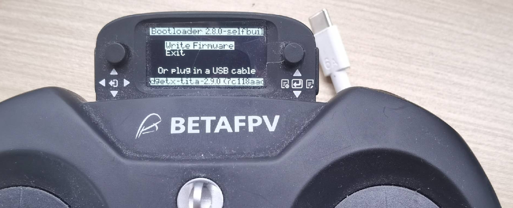
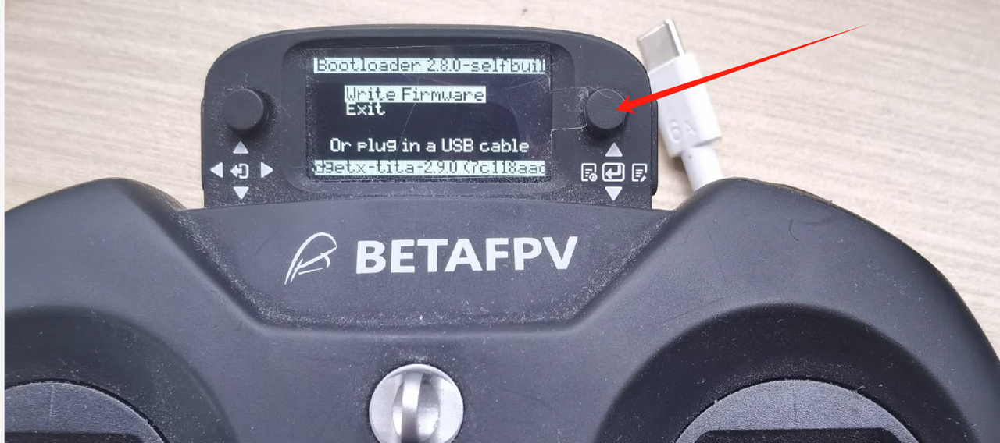
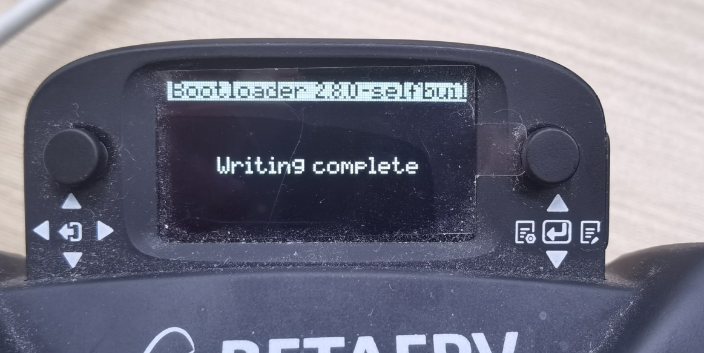

# 遥控器固件升级指南
```{toctree}
:maxdepth: 1
:glob:
```
------
**工具准备**： windows系统（11以上）、USB-C数据线
## 操作步骤
### 1.使手柄进入固件更新模式
（1） 同时按下以下两个地方的按钮，如图


（2）按下按钮后会进入如图界面，即成功进入固件更新模式

### 2.开始更新
（1）使用USB-C数据线连接手柄与电脑，电脑会弹出U盘界面（该界面是手柄内置存储器的界面）

（2）将最新的`firmware.bin`放到`FIRMWARE`目录下，如上图所示。（Ps.若没有手柄固件或最新固件的用户可联系我司售后工程师索要。）  
（3）将USB-C数据线与手柄断开，按下右边按钮，一直按着直到手柄界面出现**writing**的界面，即在烧写固件中。随即请耐心等待其烧写完毕出现**Writing Complete**的界面。如图



（4）随后按下开关机键重启手柄，按下右边按钮，朝中间按下，会出现`mode select`界面

### 3.更新接收机
完成以上步骤就是完成了第一阶段固件更新！  
接下来就是更新接收机的时候。  
（1）首先遥控器开机后，右边按键向左推进入界面后 按键依次进入Tools ->ExpressLRS->wifi connectiving->Enable wifi


（2）电脑连接wifi ,wif账号：ExpressLRS  TX     密码为：expresslrs
连接WIFI后，浏览器会弹出update Web端，如果弹不出，手动输入10.0.0.1,同时确保wifi正常连接
并选择要更新文件

（3）点击UPDATE, 如果更新不成功，如上图，先更新第一文件夹的模块

（4）更新成功会有如图界面

（5）完成以上步骤完后，重启手柄，配置遥控器控制速率，右边按键向左推进入界面后 按键依次进入Tools ->ExpressLRS->Telem Ratio  1:128 (按下选中，出现闪烁，说明选中)，如图

（6）向下推，至1：8，按下中间确定，配置完成！

至此手柄固件已全部升级完成！！