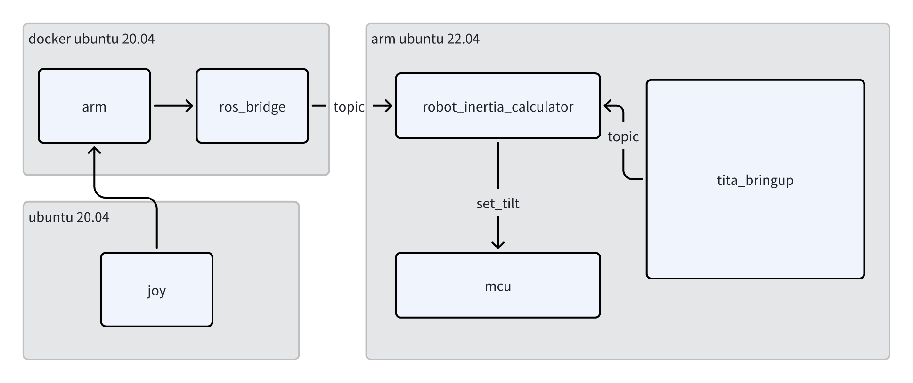
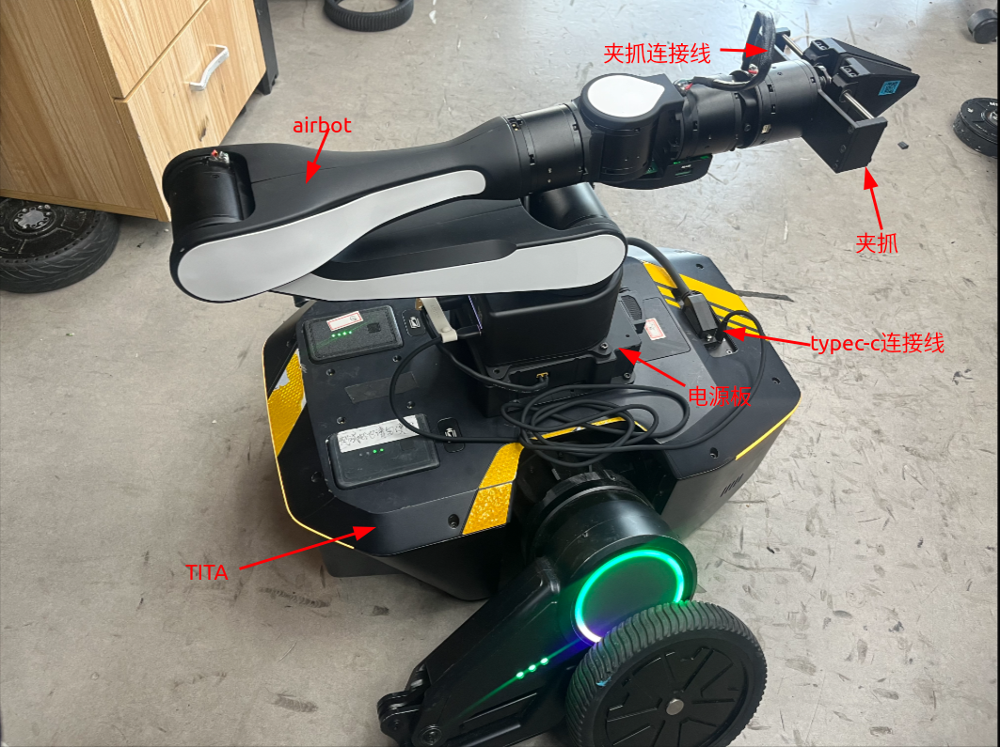

# Manipulator Configuration and Usage Tutorial
```{toctree}
:maxdepth: 1
:glob:
```
------

## MCU Board
The upper-layer SOC communicates with the lower-layer MCU via CANBUS. This method calculates the `set_tilt` value on the upper layer and sends it to the lower layer through CANBUS to achieve chassis stability control.


## AIRBOT（Qiuzhi）
### Configuration
Airbot natively supports Ubuntu 20.04 and provides ROS1 compatibility. Install Docker on the NX using the tutorial: [Docker Installation on ARM](docker_on_arm.md), If the system comes with Docker pre-installed, skip this step.

### Docker image
- pull docker image
```bash
docker pull registry.cn-guangzhou.aliyuncs.com/ddt_robot/airbot_on_tita:v1.0
```
- This image includes ros-noetic and ros2-humble. Enter Docker using
```bash
docker run -it --rm --name airbot --privileged --cap-add=SYS_PTRACE -v $HOME/.ssh:/root/.ssh --network=host -v ~/manipulator:/workspace --workdir /workspace registry.cn-guangzhou.aliyuncs.com/ddt_robot/airbot_on_tita:v1.0 /bin/bash
```
```{note}
- ROS environment variables (ros2-humble and ros1-bridge) are pre-configured in Docker - no additional setup needed.
```
### Launch
Modify the ROS_DOMAIN_ID variable in Docker:
`sudo vim ~/.bashrc`
```bash
export ROS_DOMAIN_ID=69 # Match your TITA's actual domain_id
```
After configuring Docker, save the modified image:
``` bash
# in tita host
docker commit airbot modify_airbot
```

## Launch
### Hardware Configuration

**TITA Robot** x1
**Power Board** x1
**TypeC Cable** x1
**Airbot** x1
**Gripper** x1
**Gripper Cable** x1

Connect hardware as shown:

### Software Configuration
- SSH into TITA robot
```bash
ssh robot@192.168.42.1 # wire connected to host, if use wifi, check your tita ip address 
```
- Create workspace, pull code, and launch:
```bash
cd 
mkdir manipulator && cd manipulator
git clone https://github.com/DDTRobot/airbot_on_tita
cd airbot_on_tita
bash docker_run.bash
# in docker container
source /opt/ros/noetic/setup.bash
catkin_make
bash can_up.bash # success if print "can1 up success"
bash ros_run.bash # launch ros_interface of airbot
# if in terminal print such as : 
# terminate called after throwing an instance of 'std::runtime_error'
# what():  AIRBOT Play needs to be calibrated. Please run airbot_auto_set_zero or airbot_set_zero
# please kill with `Ctrl+C` and run with `airbot_set_zero -m can1` to set arm to zero position
# more information of airbot please refer to https://discover-robotics.github.io/docs/latest/AIRBOT-Play/tutorials/env/
```
```{note}
A "click" sound indicates successful startup. After compilation, use `bash one_start.bash` on the host.
```
- Control manipulator via remote (Optional):
```{note}
Remote cannot control robot while operating manipulator.
```
New terminal → SSH into TITA:
```bash
mkdir -p airbot_joy/src && cd airbot_joy/src
git clone https://github.com/DDTRobot/airbot_joy
cd ..
colcon build 
source install/setup.bash
ros2 launch airbot_joy airbot_joy.launch.py
```
- Remote control mode setup:
1. Press right button above remote screen to enter menu
2. Select second mode (user-sdk mode, marked with "*")
3. Left joystick: XY-axis control | Right joystick: Z-axis | Bottom-right button: Reset arm
4. Chassis/arm control are decoupled: Non-SDK mode controls chassis, SDK mode controls manipulator only

### Shutdown Procedure
1. Connect robot to computer, open terminal
2. SSH into robot
3. Stop manipulator:`docker exec airbot pkill -SIGINT -f "roslaunch ros_interface airbot_arm.launch"`
4. Stop `docker` : `docker stop airbot`
```{note}
Restart manipulator by rerunning `one_start`.
```

### 常见问题：
- CANBUS failure due to can0/can1 device assignment
Solution:
1. Power on robot and wait for full boot
2. Connect Type-C cable afterward