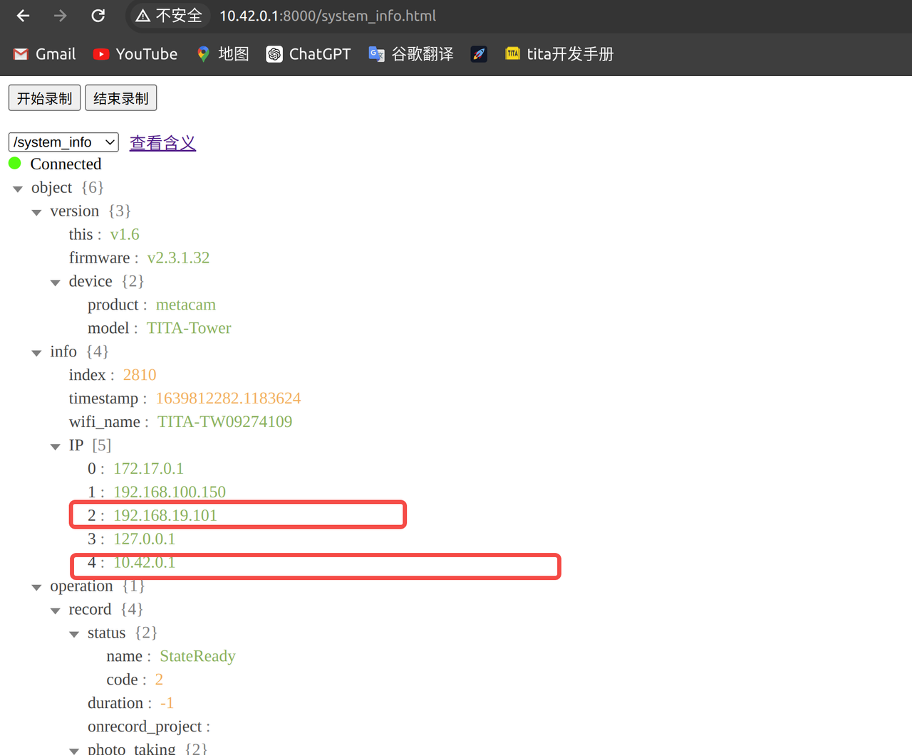
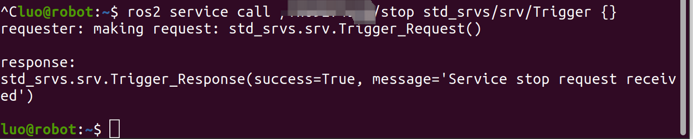

# TITA Tower使用手册

```{toctree}
:maxdepth: 1
:glob:
```

------

## 1. Quick Start

### 1.1 Preparation Work

Before using the navigation tower, the following preparatory work needs to be done:

**Installation and Power Supply**
The navigation tower is powered through TITA's DB25 external interface and requires the use of an officially certified DB25 connection cable.
Note that hot-plugging of the DB25 interface is prohibited, as it may cause abnormal power off of the navigation tower.

**Debugging**
The navigation tower supports Ethernet interfaces, and can be connected to a laptop via an Ethernet cable, supporting multi-machine interactive visual debugging.

**Viewing IP**
To view the IP, you can connect to the navigation tower's device information webpage through a hotspot: http://10.42.0.1:8000
  
   

- Notes:
  - 192.168.19.101 is the IP assigned to the wired network port
  - 10.42.0.1 is the IP assigned to the wireless WiFi


### 1.2 Environmental Configuration

- **TITA Tower's ROS_DOMAIN_ID defult value is 42**，to implement multi-machine interaction, you need to set the ROS_DOMAIN_ID on the debugging machine to 42 as well. After setting it, execute source ~/.bashrc.
- If you are using TITA in conjunction with Tower, you need to properly configure the ROS2 environment for TITA. For detailed operations, please refer to the relevant documentation《[Ubuntu System Flashing Process](https://tita-development-manual-uc.readthedocs.io/zh-cn/latest/pages/ubuntu-flash.html)》

#### 1.2.1 Testing Device Communication

After TITA is powered on, it will power up the TITA Tower. When the indicator light on the TITA Tower turns blue, it is in standby mode. At this point, you can enter the command ros2 topic list in the robot system or computer terminal, and you should see the following topics:
 

## 2. software control

 
### Enable TITA Tower


`ros2 service call start std_srvs/srv/Trigger {}`
 

### Disable TITA Tower

`ros2 service call stop std_srvs/srv/Trigger {}`
 

### Real-Time output

- **Providing High-Precision Odometry Information**
  ```bash
  nav_msgs/msg/Odometry
  ros2 topic echo mapping/odometry
  ```

- **RTK Latitude and Longitude Information（IN CHINA）**
  ```bash
  sensor_msgs/msg/NavSatFix
  ros2 topic echo rtk/gnss_soln
  ```

- **GPSLatitude and Longitude Information（OUTSIDE CHINA）**
  ```bash
  sensor_msgs/msg/NavSatFix
  ros2 topic echo gps/gnss_soln
  ```

- **Colored Mapping Point Cloud Data**
  ```bash
  sensor_msgs/msg/PointCloud2
  ros2 topic echo cloud_colored
  ```

- **Compressed Data from the Left Camera**
  ```bash
  sensor_msgs/msg/CompressedImage
  ros2 topic echo camera/left/jpeg
  ```

- **Compressed Data from the Right Camera**
  ```bash
  sensor_msgs/msg/CompressedImage
  ros2 topic echo camera/right/jpeg
  ```

- **Preview Data from the Left Camera**
  ```bash
  sensor_msgs/msg/Image
  ros2 topic echo camera/left/preview
  ```

- **Preview Data from the Right Camera**
  ```bash
  sensor_msgs/msg/Image
  ros2 topic echo camera/right/preview
  ```

### Run rviz2
If you want to see PointCloud from TITA Tower,you can use `rviz2` in your computer.After starting the TITA Tower, subscribe to `/tower/mapping/cloud_color`.
```bash
1 rviz2
```
 


