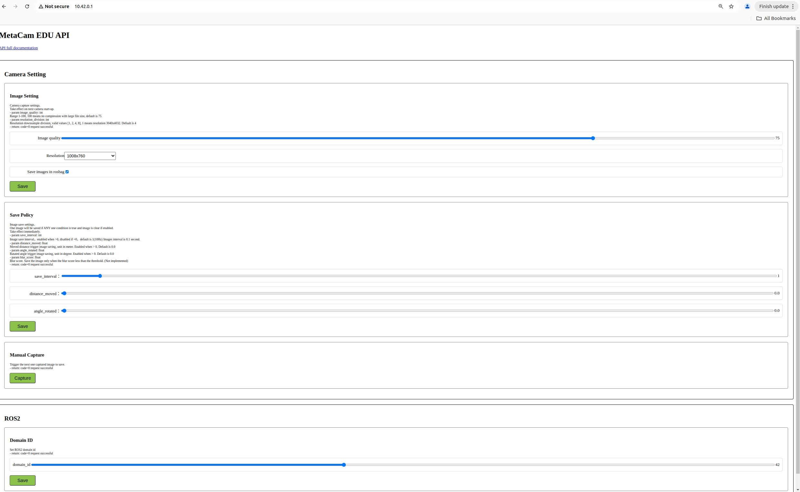

# TITA Tower使用手册

```{toctree}
:maxdepth: 1
:glob:
```

------

## 1. 快速开始

### 1.1 准备工作

在使用导航塔之前，需要做以下准备工作：

- **安装、供电**
  导航塔通过TITA本身的DB25的外接接口供电，需要使用官方认证DB25连接线。
  注意，禁止对DB25接口进行热插拔，否则会造成导航塔异常断电。
- **网络配置**
   如果是使用TITA和Tower结合，需要将TITA的eth0网口IP地址设置为静态IP，详细操作查阅《[Ubuntu系统刷机流程](https://tita-development-manual-uc.readthedocs.io/zh-cn/latest/pages/ubuntu-flash.html)》-网络配置部分。

- **调试**
  导航塔支持以太网接口，通过网线连接导航塔和笔记本电脑，支持多机交互可视化调试。

- **查看IP**
  查看IP可以通过连接热点访问导航塔设备信息网页：[http://10.42.0.1](http://10.42.0.1)
  
  - 注意：
    - 可以在该网页上更改TITA Tower的 `ROS_DOMAIN_ID`
    - `192.168.19.101` 为有线网口分配IP
    - `10.42.0.1` 为无线wifi分配的IP

### 1.2 环境配置

- **导航塔 ROS_DOMAIN_ID 默认是42**，实现多机交互需要对调试机的 `ROS_DOMAIN_ID` 也设置成`42`，设置完成后，执行 `source ~/.bashrc`


#### 1.2.1 测试设备通讯

TITA开机后会对TITA Tower上电，待TITA Tower指示灯变为蓝色时，即待机状态，此时在机器人系统中或电脑终端中输入指令 `ros2 topic list`，可以看到以下话题：
```bash 
/tower/camera/left/jpeg
/tower/camera/left/preview
/tower/camera/right/jpeg
/tower/camera/right/preview
/tower/imu/data
/tower/lidar/points
/tower/mapping/cloud
/tower/mapping/cloud_colored
/tower/mapping/odometry
/tower/navigation/cmd_vel
/tower/rtk/gnss_soln
/tower/rtk/nmea
```

## 2. 软件控制

 
### 开启软件功能

```bash
 ros2 service call /tower/mapping/start std_srvs/srv/Trigger {}
```
如果成功，会返回：
```bash
robot@tita:~/TowerNetworkManager$ ros2 service call /tower/mapping/start std_srvs/srv/Trigger {}
requester: making request: std_srvs.srv.Trigger_Request()

response:
std_srvs.srv.Trigger_Response(success=True, message='Service start request received')
```

### 关闭软件功能
```bash
ros2 service call stop std_srvs/srv/Trigger {}
```
如果成功，会返回：
```
robot@tita:~/TowerNetworkManager$ ros2 service call /tower/mapping/start std_srvs/srv/Trigger {}
requester: making request: std_srvs.srv.Trigger_Request()

response:
std_srvs.srv.Trigger_Response(success=True, message='Service start request received')

```

### 实时输出

- **能够提供一个高精度的里程计信息**
  ```bash
  nav_msgs/msg/Odometry
  ros2 topic echo /tower/mapping/odometry
  ```

- **RTK的经纬度信息（国内）**
  ```bash
  sensor_msgs/msg/NavSatFix
  ros2 topic echo /tower/rtk/gnss_soln
  ```

- **GPS的经纬度信息（国外）**
  ```bash
  sensor_msgs/msg/NavSatFix
  ros2 topic echo /tower/gps/gnss_soln
  ```

- **彩色建图点云数据**
  ```bash
  sensor_msgs/msg/PointCloud2
  ros2 topic echo /tower/mapping/cloud_colored
  ```

- **左侧相机压缩数据**
  ```bash
  sensor_msgs/msg/CompressedImage
  ros2 topic echo /tower/camera/left/jpeg
  ```

- **右侧相机压缩数据**
  ```bash
  sensor_msgs/msg/CompressedImage
  ros2 topic echo /tower/camera/right/jpeg
  ```

- **左侧相机预览数据**
  ```bash
  sensor_msgs/msg/Image
  ros2 topic echo /tower/camera/left/preview
  ```

- **右侧相机预览数据**
  ```bash
  sensor_msgs/msg/Image
  ros2 topic echo /tower/camera/right/preview
  ```

### 启动rviz
可以在你的电脑（需要装有`rviz2`的电脑并且`ROS_DOMAIN_ID`与机器人的一致)启用rviz2并如图添加TITA Tower彩云的topic查看TITA Tower建图情况。
```bash
rviz2
```
 


### 常见问题

- 接上电源后，感知塔指示灯蓝色待机状态，但在TITA host 终端中输入指令 `ros2 topic list` 无/tower/imu/data等话题，如何解决？

  - 原因：
    - 可能是ROS_DOMAIN_ID设置错误，请检查是否设置正确。
    - 也可能是网络配置eth0网口IP地址设置错误，请检查是否设置正确。
  - 解决方法：
    - 请检查ROS_DOMAIN_ID是否设置正确，执行 `echo $ROS_DOMAIN_ID` 查看是否为42或者其他值。
    - 请检查TITA 的eth0网口IP地址是否设置正确，执行 `ifconfig eth0` 查看是否为192.168.19.90


