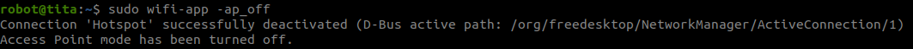

# WIFI 便携式应用
```{toctree}
:maxdepth: 1
:glob:
```
------

## 安装部署
```
sudo apt install network-manager
git clone https://github.com/DDTRobot/config_of_documents.git
cd config_of_documents
sudo chmod +x install.sh
sudo ./install.sh
#Power off and restart
```
```{note}
如果上述成功安装，机器人开机后=内置的wifi模块功能默认开启ap热点模式
wifi名：TITAxxxxxxx
密码：12345678
ip地址：10.42.0.1 
```

## 使用指令

1、由于默认开启ap热点模式，想要连外部 wifi模块需要关掉ap模式
```
 sudo wifi-app -ap_off
```


2、连接wifi
```
sudo wifi-app -on
```

(1) ctrl+c #enter
(2) 输入wifi名 #enter
(3) 密码 #enter


3、临时关闭wifi ap 模式
```
sudo wifi-app -ap_off
```
4、永久关闭 ` systemctl stop wifi-app.service `
