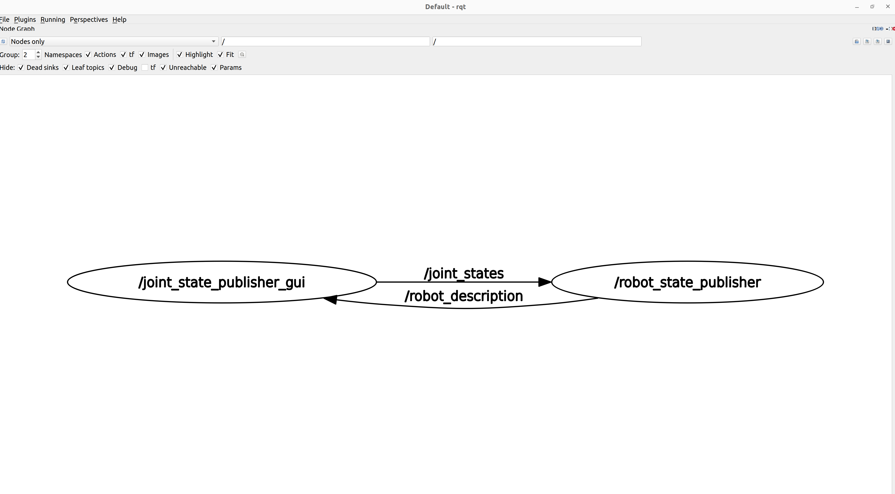
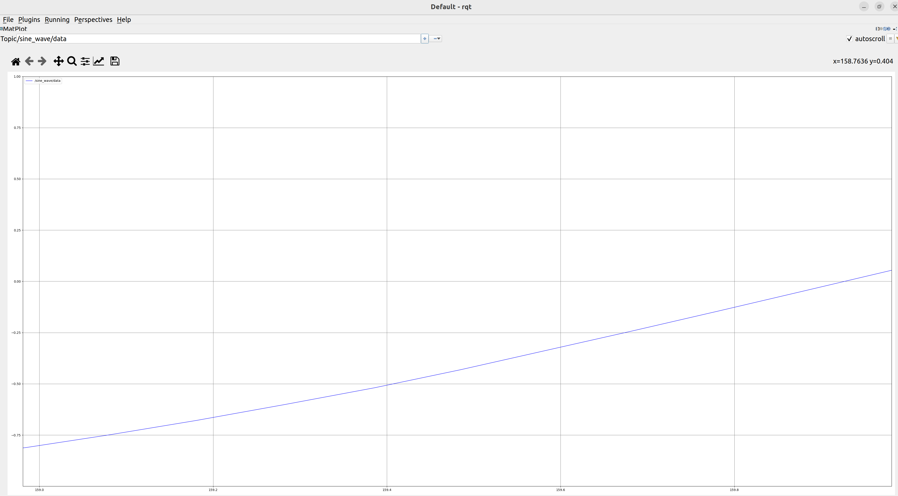
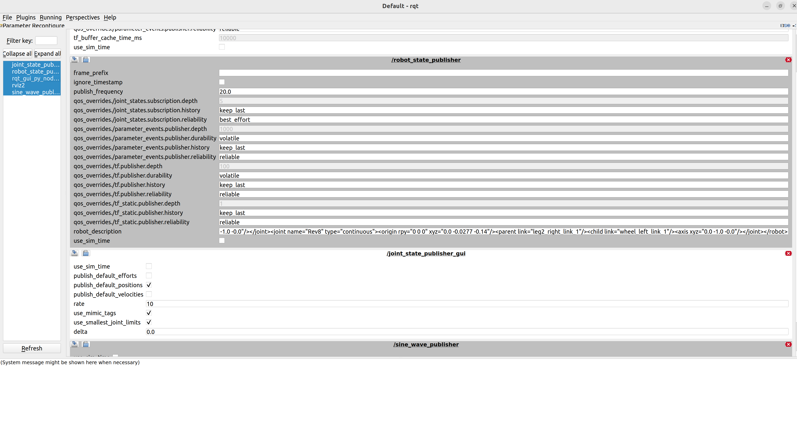
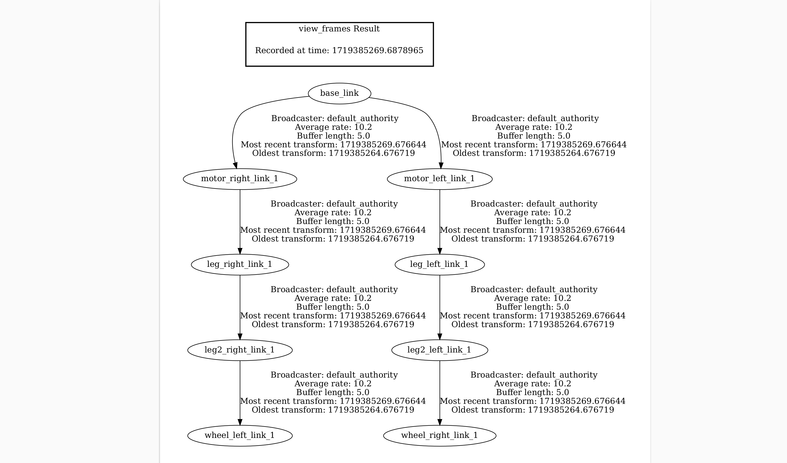

# Rqt 数据分析工具

```{toctree}
:maxdepth: 1
:glob:
```

------

​	rqt 是 ros 的 qt 图形化调试工具，其中包含了许多常用且十分重要的图形化显示的开发工具。

### 一、观察所有节点之间的连接关系

​	使用 rqt graph 操作，来显示节点之间的连接关系。



#### 二、可视化变量变化曲线

​	对于一些实时变量，可以通过 rqt plot 插件来对变量的变化进行直观的查看。（尽量不要订阅频率较高的数据，由于rqt开发的不够好，高频的数据会导致软件崩溃）

	

#### 三、图形化动态设置参数

​	可以在 rqt 的 Dynamic Reconfigure 中快速的设置节点的参数



#### 四、tf frame 连接图

​	使用 `ros2 run tf2_tools view_frames` 命令可以将 /tf 坐标关系保存成 pdf 文件。


