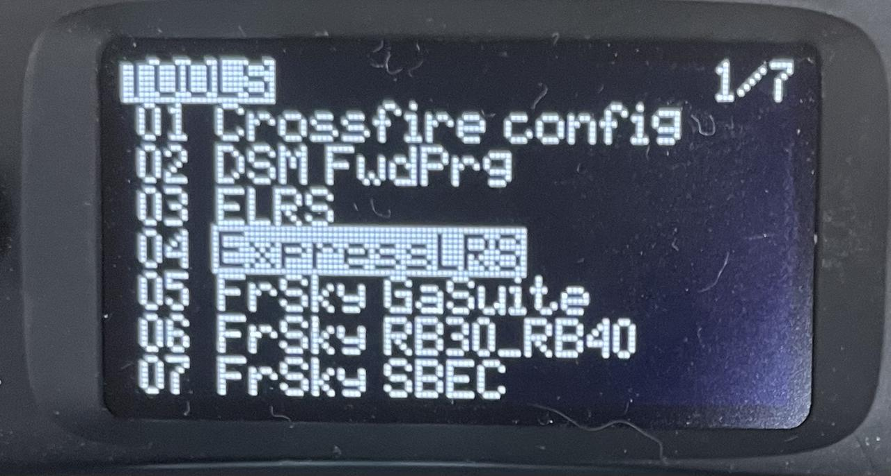

# Remote Joystick Pairing Guide
```{toctree}
:maxdepth: 1
:glob:
```
------
**（Perform this operation in the robot）**
The latest robotic systems now come with built-in remote control pairing software, and there are two methods to quickly pair the remote control.
```{note}
For older system versions, you can contact the FAE to obtain the remote control pairing software installation package.
```
**Method One**
1. sudo dpkg -i crsf_deb.deb   (If it is already included or installed, please skip this step.)
2. Execute the command `crsf-app -bind`, you can observe the return：   
```{bash}
robot@tita:~$ crsf-app -bind
Checking uart status...
Uart connect success
Entering bind mode...
Bind mode success
Please enter TOOLS->ExpressLRS->[Bind] and binding in remote control
```

3. After powering on the remote control, push the button on the right side to the left to enter the interface, then press the buttons in sequence to go to `Tools -> ExpressLRS -> bind mode` for pairing the receiver.
 
 
4. Pairing completed, return "pair success"


**Method Two**
1. First, you need a dual-headed Type-C data cable, like this:

2. Connect the data cable to the EXT port on the robot and the data port on the remote control, like this:


```{note}
The robot and the controller must be powered on.
```
3. The remote control will display the `Select mode` interface, and select the third option `USB Serial`.

4.Wait patiently for the pairing. If the pairing is successful, the robot's battery information will be displayed in the upper right corner of the remote control interface.
