# Remote Joystick Updating Guide
```{toctree}
:maxdepth: 1
:glob:
```
------
**Tool Preparation:** Windows 11, USB to Type-C cable  
**SoftWare:** You can contact FAE to obtain it.  
**Operation Process:**
1. Enter firmware update mode for the controller:  
(1) Press the buttons in the following two places simultaneously.  
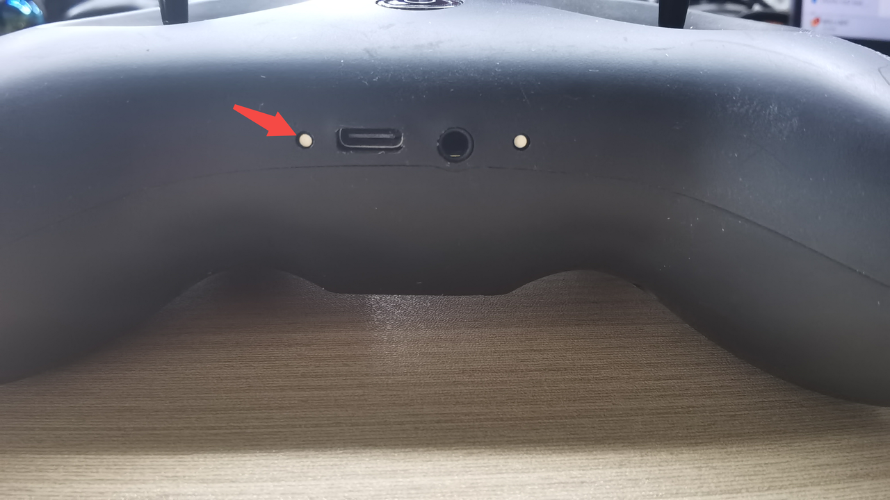
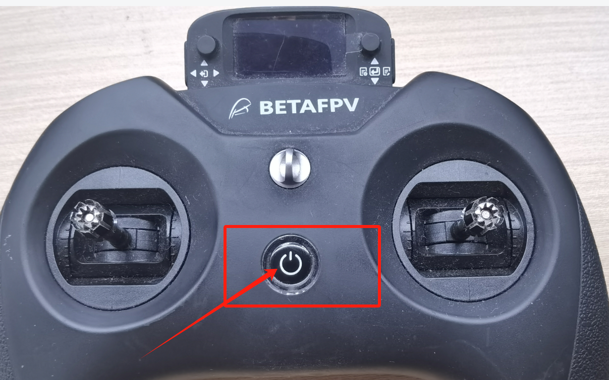
（2） Successfully enter the firmware update mode.  
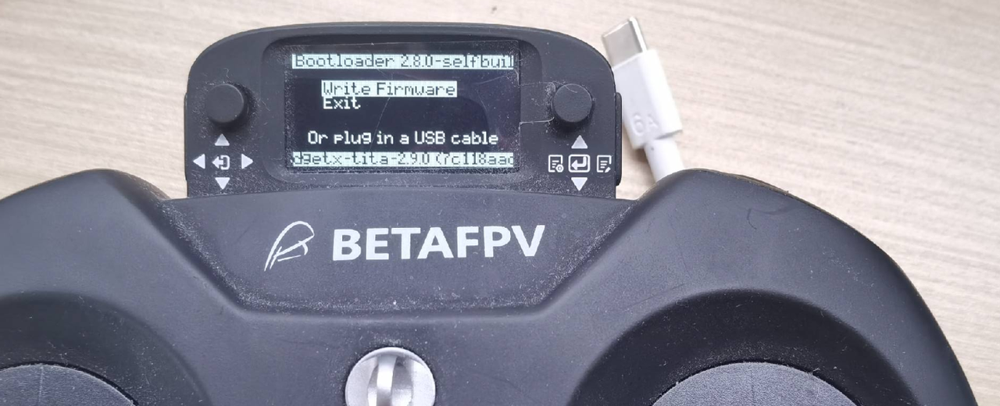

2. Start the update:  
（1）Connect the flashing computer to the controller with a USB to Type-C cable, at this point, a disk will pop up!  
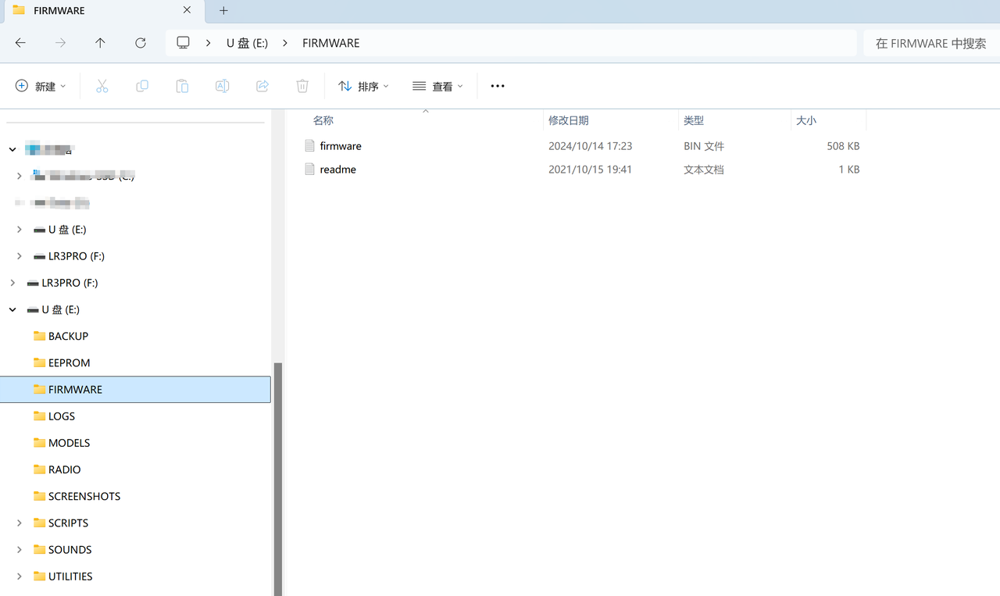
（2）Place the latest firmware.bin into the `FIRMWARE` directory, as shown above.  
```{note}
The naming of firmware is case-insensitive; sometimes the provided firmware name may be in lowercase FIRMWARE.
```
（3）Disconnect the USB to Type-C cable from the controller, press the small button on the right, and hold it down until "writing..." appears.
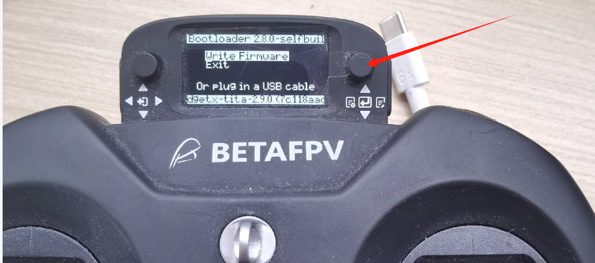
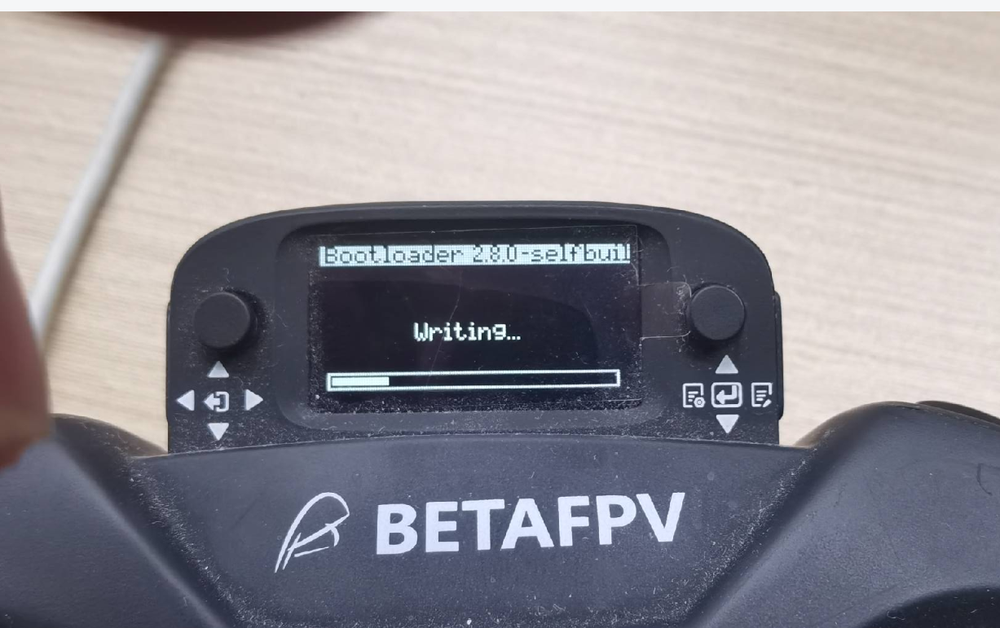
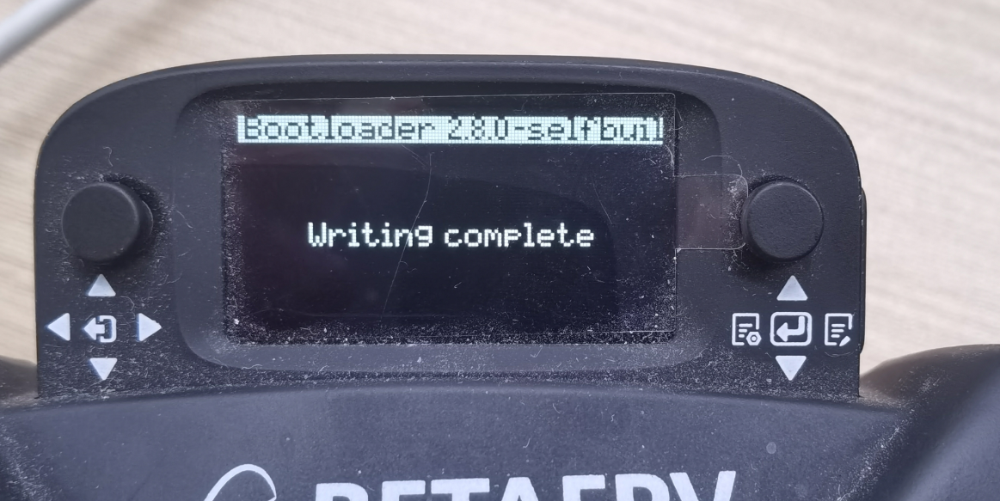

（4）Then restart and press the small button on the right side of the small screen, press towards the center to display the "mode select" interface.
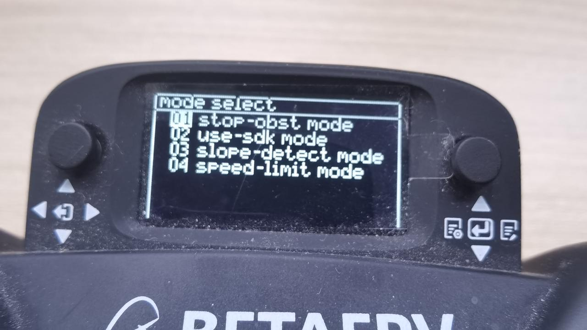
==Congratulations, you have completed the first stage of firmware update!==
（5） After the remote control is turned on, push the button on the right to the left to enter the interface, then press the buttons in sequence to go to Tools -> ExpressLRS -> wifi connectiving -> Enable wifi.  
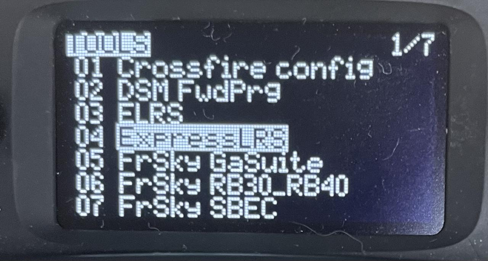
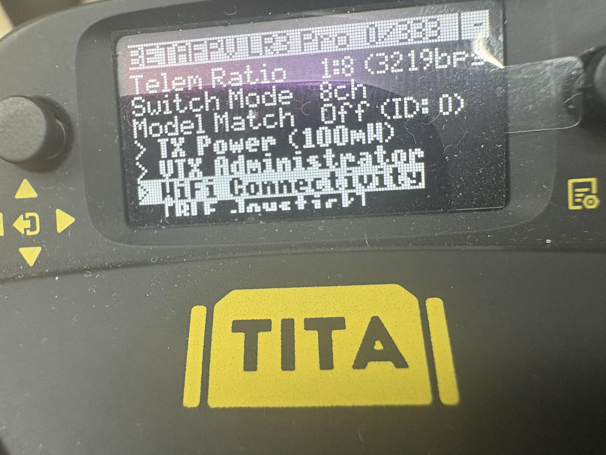
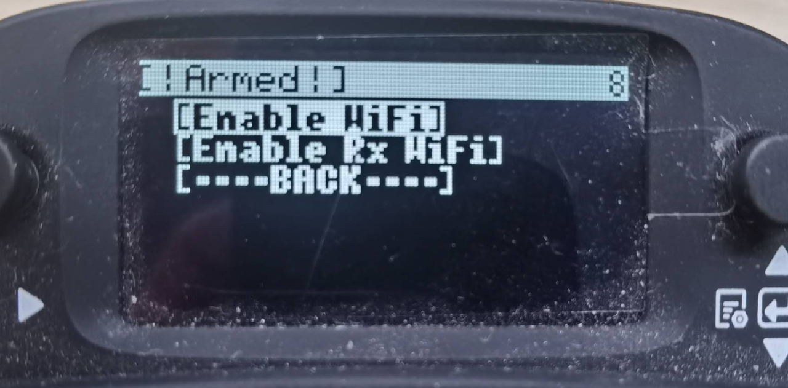
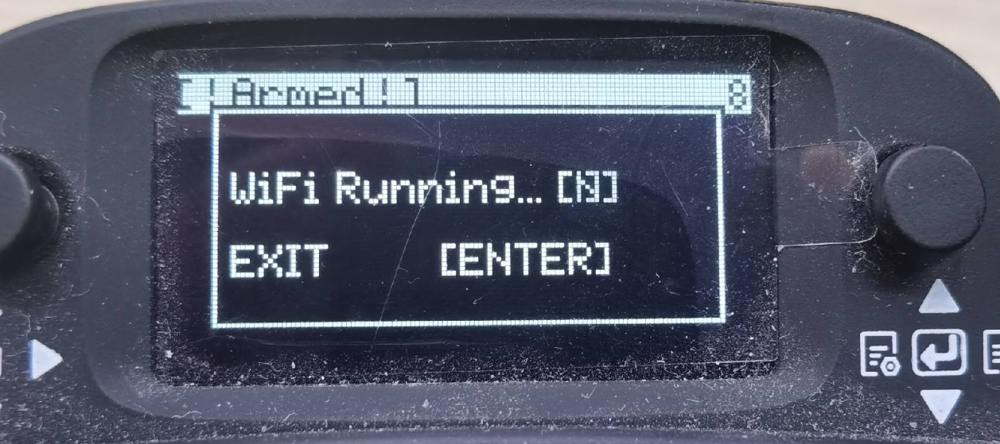
（6） Connect the computer to wifi, wifi account name: ExpressLRS TX, the password is: expresslrs. 
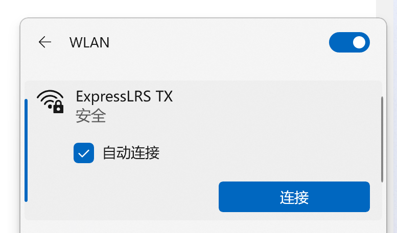
 （7）At this time, the browser will pop up the update web interface, if it does not pop up, manually enter 10.0.0.1, and ensure that the wifi is connected normally.
 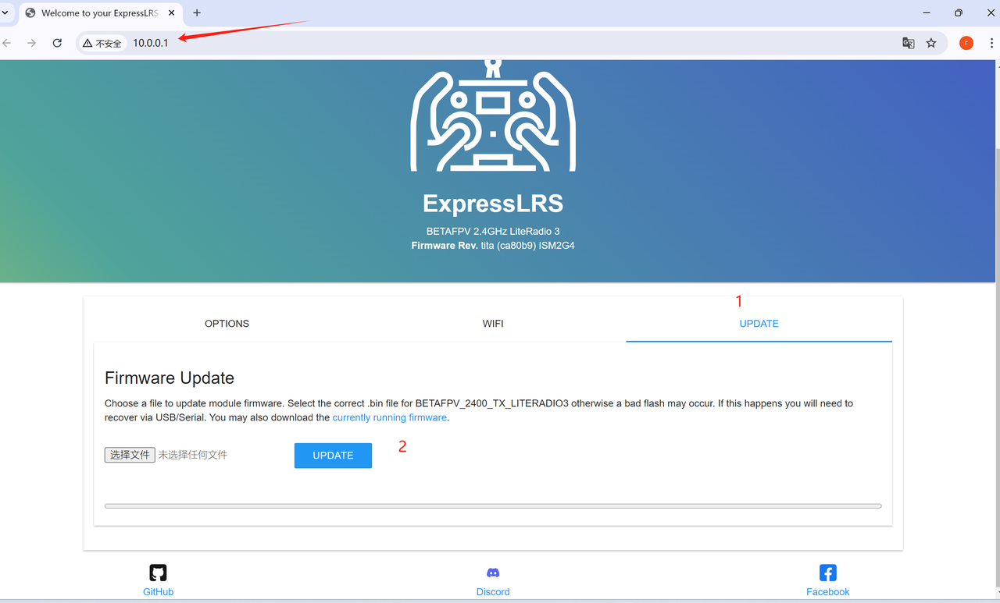
 （8）And then select the file to be updated.
 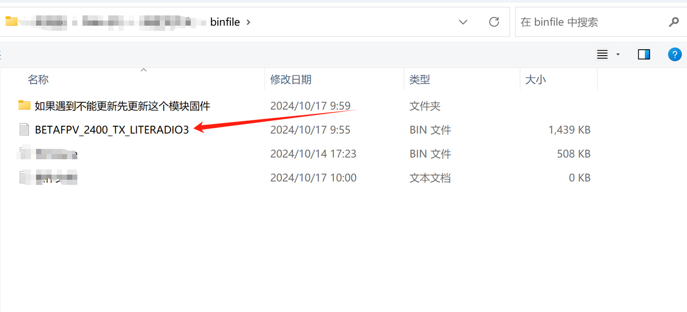
 （9）Click UPDATE, if the update is not successful, as shown in the diagram above, first update the modules in the first folder.
  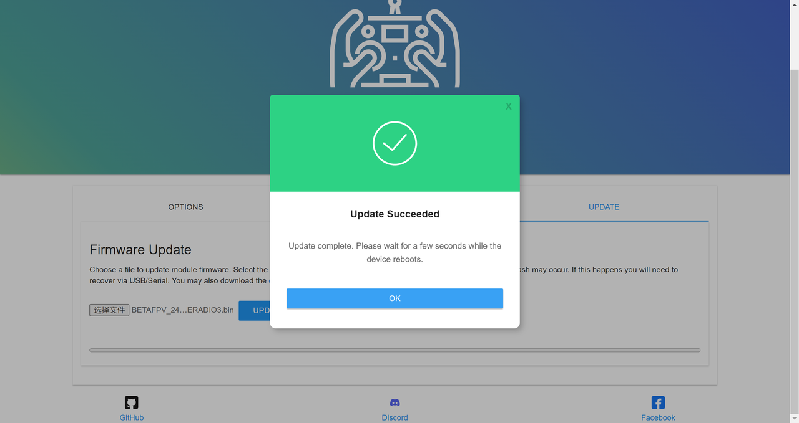
 （10）After the above steps, restart the controller, configure the remote control rate, push the button on the right to the left to enter the interface, then press the buttons in sequence to go to Tools -> ExpressLRS -> Telemetry Ratio -> 1:128 (press to select, it will flash, indicating it is selected)
 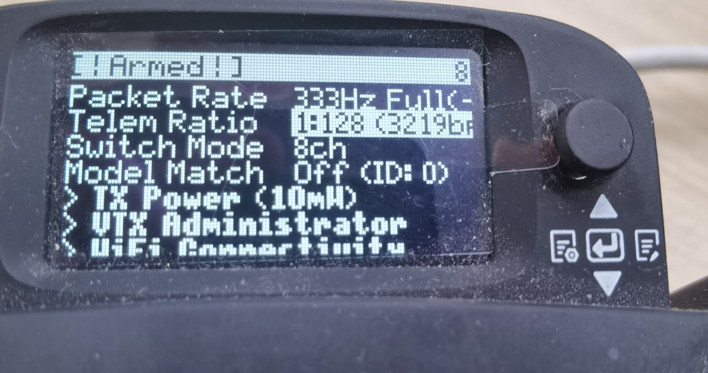
 (11) push down to 1:8, press the middle to confirm, configuration is complete, restart once!
  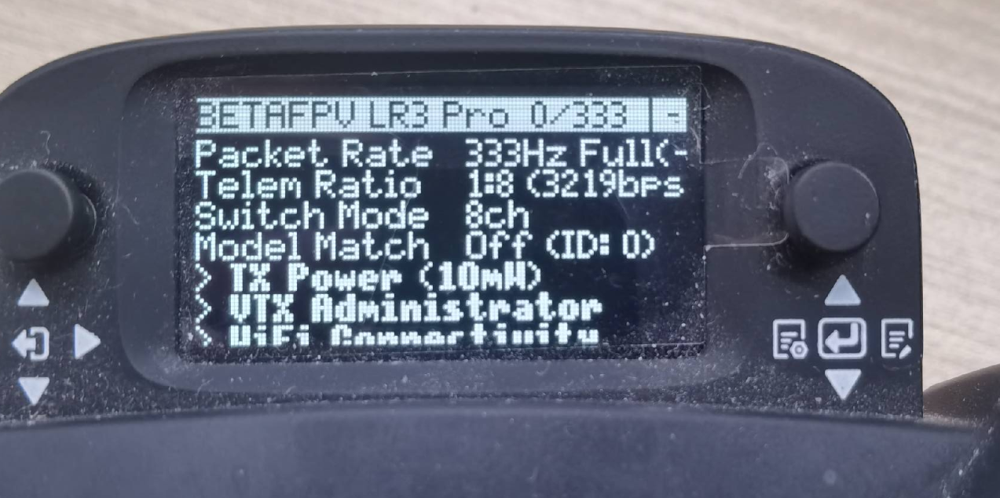
  <h3>With this, the remote joystick upgrade process is successfully completed.</h3>