# 四轮足组装说明

```{toctree}
:maxdepth: 1
:glob:
```

------
1. 将两台TITA机器人尾部对尾部放置在地上，取开机器人顶部的拓展口盖板。<br>

    

2. 使用M4扳手拆除两台TITA机器人顶部的导轨，然后将上拓展板放置在TITA机器人顶部。<br>
   

   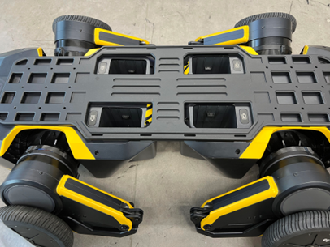
3. 将拆下来的导轨放置在拓展板顶部，并将顶部的9个螺丝孔从上到下对齐。<br>
   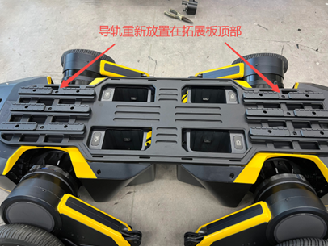

   
4. 使用M4x30螺丝（拓展板配件中最长的螺丝），从顶部导轨的螺丝孔插入，此时可以移动机器人位置，使螺丝能完整插入至机器人上盖的孔位，注意上拓展板要位于机器人居中位置。<br>
   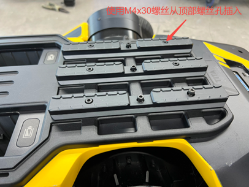

   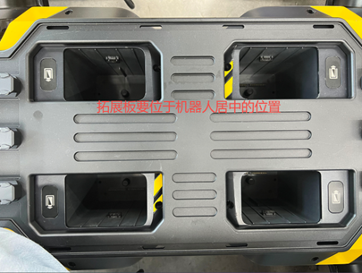
5. 将插入顶部的18颗螺丝锁紧，注意需要先将所有螺丝都拧入螺丝孔，再将螺丝一一锁紧，避免拓展板错位变形。<br>
   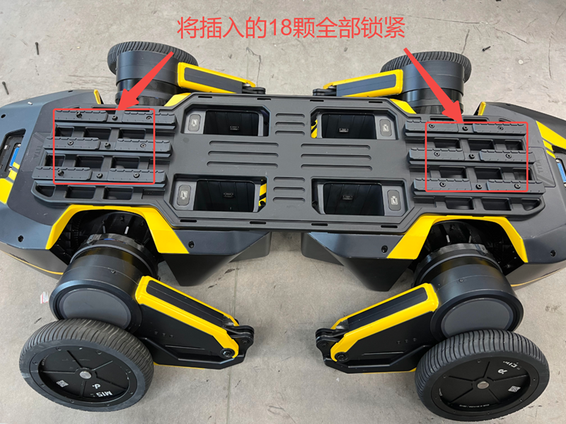
6. 取出下拓展板与连接盒，将连接盒放置在拓展板中心，拓展板两端有凸台的朝上，使连接盒与拓展板中心的4个螺丝孔对齐，再使用4颗M3x14螺丝（拓展板配件中最短的螺丝），从上往下锁紧连接盒。<br>
   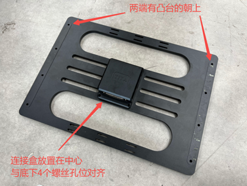

   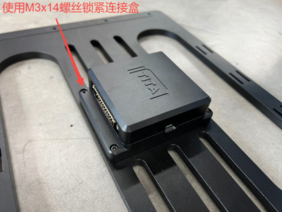
7. 将机器人底朝上倒转，撕开尾部防滑胶垫，拆除胶垫底下的8颗螺丝。<br>
   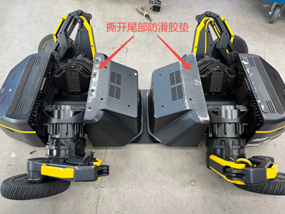

   
8. 连接盒方向朝下，将下拓展板放置在两台机器人中间，再将8个螺丝孔位对齐。<br>
   
9.  使用M4x16螺丝，将下拓展板锁紧在机器人底部，注意需要先将所有螺丝都拧入螺丝孔，再将螺丝一一锁紧，避免拓展板错位变形，螺丝锁紧后再将撕下的胶垫贴到下拓展板螺丝孔位上的凹坑。<br>
    

    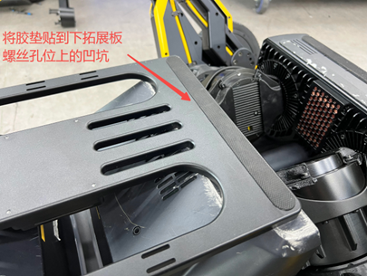
10. 将机器人重新倒转放置，取出配件的两条DP25连接线，连接两端的机器人拓展口与中间的连接盒，两台机器人都要连接。<br>
    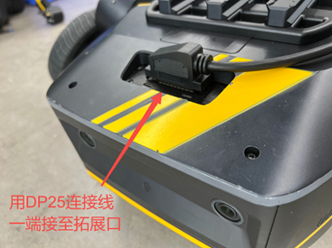

    
11. 使用配件的魔术贴绑带（可按实际需要裁剪），将DP25连接线固定在拓展板两侧的扎线口上，具体可按实际需要来固定。<br>
    
    
    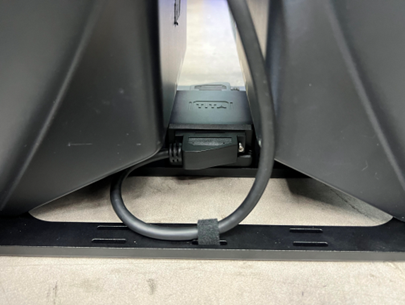
12. 完成以上步骤后，即搞定四轮足机器人的装配操作，现在可以使用四轮足啦！<br>
    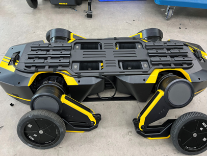


