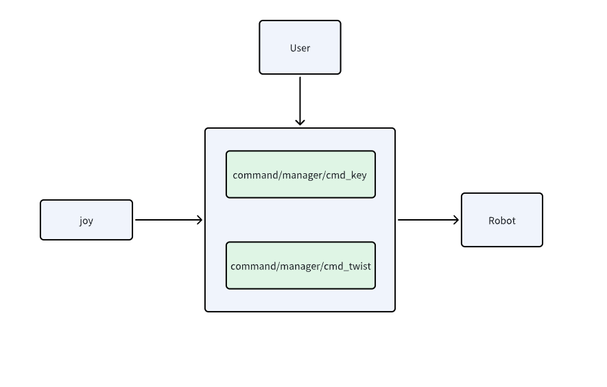

# 四轮足控制API说明

```{toctree}
:maxdepth: 1
:glob:
```

## 四轮足控制API

发布的 ROS2 Topic

|ROS Topic                |Interface                |Description |
|:--------:               |:-------:                |:-----------:|
|command/manager/cmd_key  |std_msgs::msg::String    |状态切换|
|command/manager/cmd_twist|geometry_msgs::msg::Twist|线速度、角速度控制|             |




## 使用说明
在控制中，设置安全检测，订阅了线速度和角速度心跳检测，只需要发布一个0.0的线速度和角速度，才能进行状态切换。同时，如果遥控器在打开的情况下，不进行任何操作，一直会发布一个0.0的线速度和角速度，这时如果用户发布一个非0.0的线速度和角速度，则被遥控器控制消息覆盖，用户控制参数失效。只需要关闭遥控器，避免控制参数失效。

1 示例：
```
// 创建发布者
rclcpp::Publisher<std_msgs::msg::String>::SharedPtr string_publisher_;

string_publisher_ = get_node()->create_publisher<std_msgs::msg::String>(
    tita_topic::manager_key_command,  
    rclcpp::SensorDataQoS().reliable());

// 发布消息的代码
auto msg = std_msgs::msg::String();
msg.data = "idle";  // 或其他你想要发送的字符串

string_publisher_->publish(msg);
```
| 模式名称 | 描述 |
|:--------|:-------:                |
|站立模式|"transform_up"|
|趴下模式|"transform_down"或者"idle"|
|爬行楼梯|"jump"|
|平地模式|"balance_stand"|


2 示例：
```cpp
// 创建发布者
rclcpp::Publisher<geometry_msgs::msg::Twist>::SharedPtr cmd_vel_publisher_;

// 初始化
cmd_vel_publisher_ = get_node()->create_publisher<geometry_msgs::msg::Twist>(
    tita_topic::manager_twist_command, 
    rclcpp::SensorDataQoS().reliable());

// 2. 创建并发布消息
auto twist_msg = std::make_shared<geometry_msgs::msg::Twist>();
twist_msg->linear.x = 1.0;   // 设置线速度
twist_msg->linear.y = 0.0;
twist_msg->linear.z = 0.0;
twist_msg->angular.x = 0.0;
twist_msg->angular.y = 0.0;
twist_msg->angular.z = 0.5;  // 设置角速度

cmd_vel_publisher_->publish(*twist_msg);
```
取值范围

- 线速度：-1.0 ~ 1.0
- 角速度：-1.0 ~ 1.0