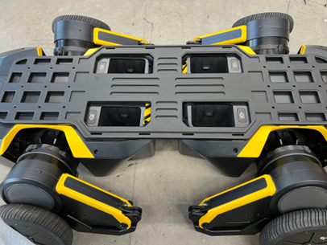
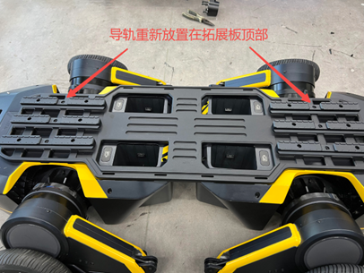
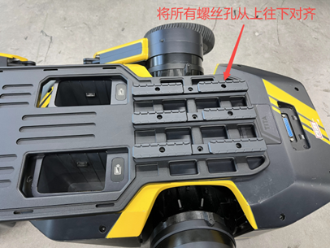
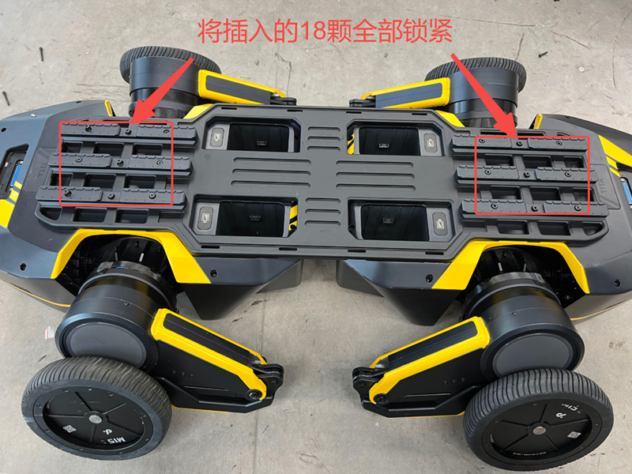
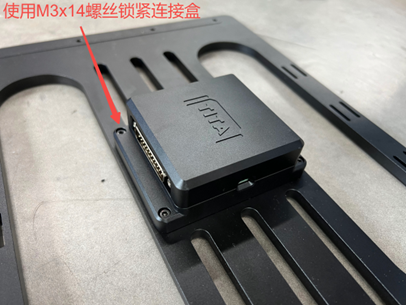
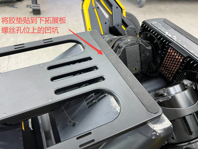

# Four-Wheel-Leg Assembly Instructions

```{toctree}
:maxdepth: 1
:glob:
```

------
1. Place the two TITA robots tail-to-tail on the ground and remove the top expansion port covers.  
    

2. Use an M4 wrench to remove the top rails of both TITA robots, then place the upper expansion plate on top of the robots.  
   

   
3. Place the removed rails on top of the expansion plate, and align the 9 screw holes from top to bottom.  
   

   
4. Use M4x30 screws (the longest ones in the expansion kit), insert them through the screw holes on the top rails. You may move the robots slightly so the screws align perfectly with the holes on the robot's top cover. Ensure the upper expansion plate is centered on the robots.  
   

   
5. Tighten the 18 screws on top. Be sure to insert all screws into their holes before tightening them one by one to avoid misalignment or deformation of the expansion plate.  
   
6. Take out the lower expansion plate and connection box. Place the connection box in the center of the plate, with the raised ends of the plate facing up. Align the 4 screw holes in the center, then use 4 M3x14 screws (shortest in the kit) to tighten the connection box from top to bottom.  
   

   
7. Flip the robots upside down, peel off the anti-slip pads at the tail, and remove the 8 screws underneath.  
   

   
8. With the connection box facing down, place the lower expansion plate between the two robots, and align the 8 screw holes.  
   
9. Use M4x16 screws to fasten the lower expansion plate to the bottom of the robots. Again, insert all screws first before tightening them one by one to prevent misalignment. After tightening, stick the previously removed pads back onto the recessed screw holes on the plate.  
    

    
10. Flip the robots back upright. Take the two DP25 cables from the kit and connect both robot expansion ports to the connection box in the middle. Make sure both robots are connected.  
    

    
11. Use the velcro straps from the kit (cut to length if needed) to secure the DP25 cables to the cable tie slots on either side of the expansion plate. Secure them based on actual conditions.  
    

    
12. After completing the steps above, the assembly of the four-wheel-leg robot is done. You can now use the four-wheel-leg mode!  
    