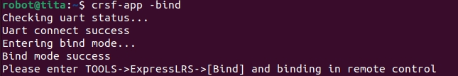
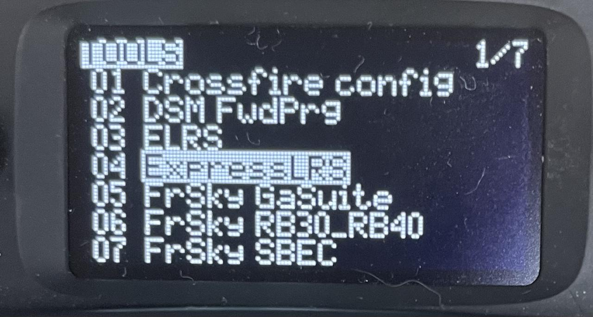
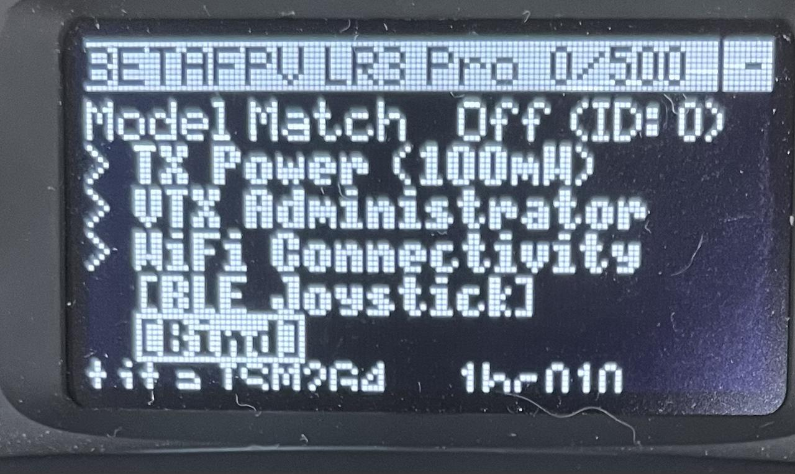
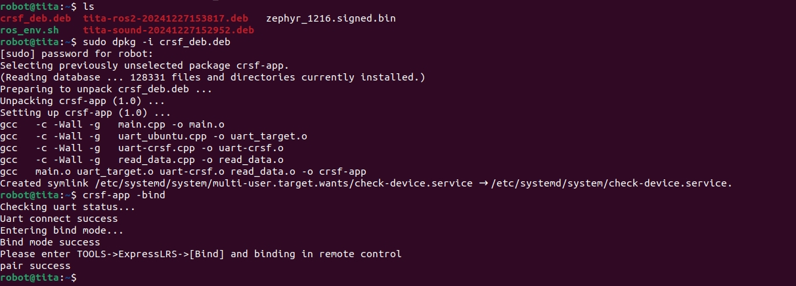

# 遥控手柄配对指南

```{toctree}
:maxdepth: 1
:glob:
```

------

本节介绍如何将遥控器配对到D1机器人。

```{note}
对于较旧的系统版本，使用 `sudo apt install crsf-app` 安装遥控器配对软件
```

1. 使用`sudo dpkg -i crsf-app`（如果已经包含或已安装，请跳过此步骤。）
```bash
#如果没有安装 `crsf-app` 可以通过以下指令
sudo apt-get install crsf-app
```
2. 执行指令`crsf-app -bind`，可以观察到返回：
 
3. 遥控器开机后 右边按键向左推进入界面后 按键依次进入Tools ->ExpressLRS-> bind模式，进行配对接收机.
 
  
4. 配对完成返回pair success
 

