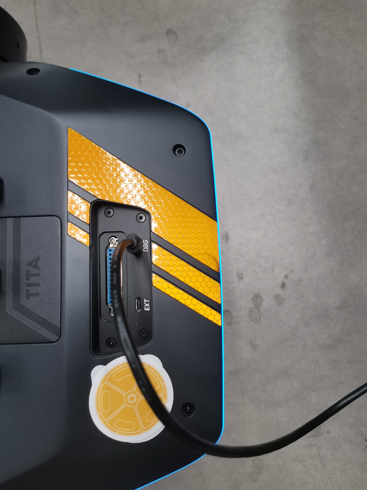
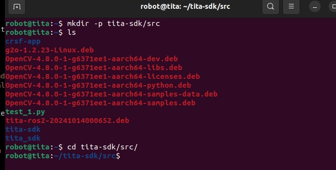
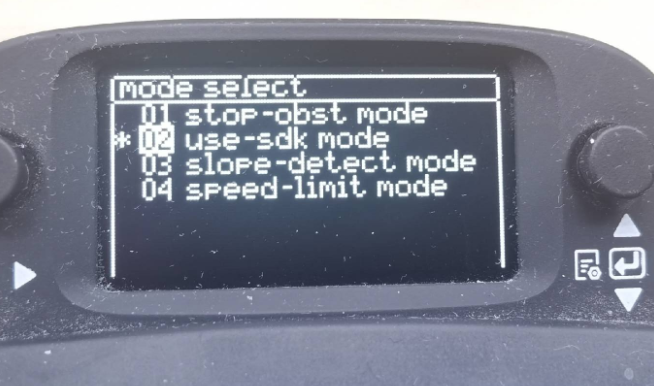

# Quick Start
```{toctree}
:maxdepth: 1
:glob:
```
------
For novice users, we have provided a tailored Demo for the TITA Ubuntu system. This Demo allows you to control the robot to perform simple actions and become familiar with the development process, system framework, and functional features of the TITA system. Let's quickly get started with TITA!

TITA Demo in GitHub：https://github.com/DDTRobot/TITA-SDK-ROS2

## SDK Operation Steps

- First, we need to access the TITA system
connect usb-c cable on the robot , like this

```bash
ssh robot@192.168.42.1
password : apollo
```
- After entering the system, we need to create a folder for the code repository we want to clone and then enter it, as shown in the figure.
```bash
mkdir -p tita-sdk/src
cd tita-sdk/src
```

- After entering the folder, we need to clone our SDK repository and then compile it.
```bash
git clone https://github.com/DDTRobot/TITA-SDK-ROS2.git
colcon build

Notice:During compilation, you may encounter the error "colcon command not found." In this case, you will need to install the colcon tool by running the command sudo apt install python3-colcon-common-extensions.

```
- After the compilation is complete, you will see the following printed information, as shown in the figure.


- Once everything is ready, you first need to `source` the setup.bash in the SDK.
```bash
source install/setup.bash
```
- Finally, you can start executing the SDK! 
```bash
ros2 launch tita_bringup sdk_launch.py
```
- Next, we need to use the remote control to put the robot in a standing position.
- Then press the small button on the right side of the remote control's small screen towards the center, and a screen named "mode select" will appear on the display.

- Push the button downwards to select "use-sdk mode" and press it. The robot will then automatically execute the transition, handing over control to the SDK that was just run. At this point, the remote control will no longer be able to control the robot, except for the buttons that make the robot stand up or lie down.


```{note}
1. If the robot continues to operate automatically after ros2 launch tita_bringup sdk_launch.py exits, it means that the use-sdk control authority has not been released. In this case, you will need to turn off the use-sdk mode on the remote control.
2. If the robot does not respond, it may be because the angular.z value in sdk_command_node.cpp is set too low. You should increase the value of angular.z.
3. The range for sdk_speed should be: ±6 rad/s
4. The range for turn_speed should be: ±3 m/s
```