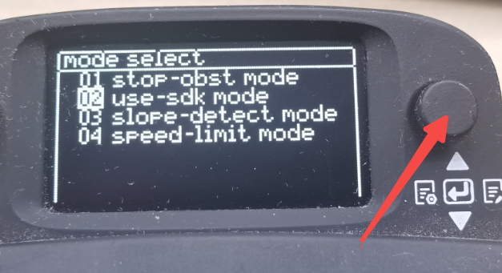
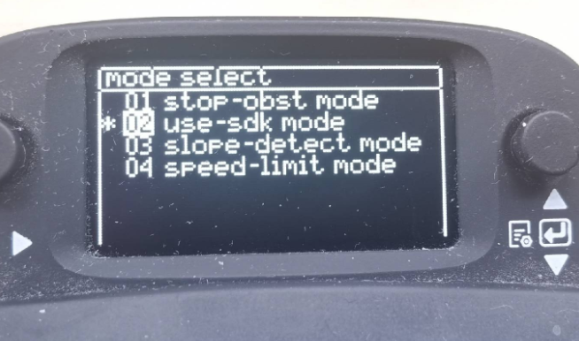

# Quick Start
```{toctree}
:maxdepth: 1
:glob:
```
------
针对一些新手用户我们提供了为TITA Ubuntu系统量身打造的Demo，该Demo是通过ROS2控制机器人进行简单动作并熟悉TITA系统的开发流程、系统框架、功能特点等。接下来就让我们快速上手TITA！

这是TITA Demo在github上的仓连接：https://github.com/DDTRobot/TITA-SDK-ROS2

## SDK操作步骤

- 首先我们要进入TITA的系统中
```bash
ssh robot@192.168.42.1
password : apollo
```
- 进入系统后我们为需要克隆的代码仓建一个文件夹并进入,如图
```bash
mkdir -p tita-sdk/src
cd tita-sdk/src
```

- 进入文件夹后需要将我们SDK的仓克隆下来并编译
```bash
git clone https://github.com/DDTRobot/TITA-SDK-ROS2.git
colcon build

Notice:在执行编译时可能会出现 colcon commond not found，我们就需要安装一下 colcon 工具，执行 sudo apt install python3-colcon-common-extensions

```
- 编译完成后会有以下打印信息，如图


- 一切准备好后，我们先要`source` SDK中的setup.bash
```bash
source install/setup.bash
```
- 这样我们就可以开始执行SDK啦！
```bash
ros2 launch tita_bringup sdk_launch.py
```
- 接下来我们需要使用遥控器将机器人控制处于站立状态
- 然后按下遥控器小屏幕右边的小按钮，朝中间按下，届时显示屏会出现名为 “mode select” 的界面。

- 使用按钮往下推，选中"use-sdk mode"按下，机器人将自动执行，由刚刚执行的SDK接管控制权限，此时遥控器将无法控制机器人，但除了使机器人站立或趴下按钮。 


```{note}
1. 如果ros2 launch tita_bringup sdk_launch.py退出后，机器人仍然会自动执行，除非释放use-sdk控制权限，届时就需要将遥控器的use-sdk模式关掉
2. 如果出现机器人没有反应，sdk_command_node.cpp中angular.z值给太小了，应当加大angular.z的值。
3. sdk_speed 值范围:±6 rad/s
4. turn_speed 值范围：±3 m/s
```