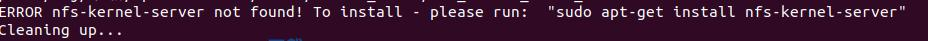

# Ubuntu System Flashing Process
```{toctree}
:maxdepth: 1
:glob:
```

------
## Precautions
1.  Please read the usage instructions and flashing documentation carefully. Starting the flashing process implies that you have read the following instructions. Any consequences that arise are the responsibility of the customer.
2. Flashing the system is an irreversible process; once the Ubuntu system is successfully installed, it is not possible to flash back to the original Yocto system.
3. The current version of the flash is a preliminary version intended for system replacement, with a limited number of built-in functional APIs as follows: ToF data, motion control functions; for future updates on other functional APIs, please pay attention to the official website of Moonshot Robotics.

## Preparation Work
Hardware Preparation: The flashing cable that comes with TITA (with logo A facing outwards, insert into the DBG port, plug in the cable before powering on); an Ubuntu system computer.
This operation requires downloading the flashing package to the computer (a Linux system is required), creating a new folder, and extracting the flashing package into the newly created folder.
```bash
0. sudo apt install abootimg binfmt-support binutils cpio cpp device-tree-compiler dosfstools
        lbzip2 libxml2-utils nfs-kernel-server openssl python3-yaml qemu-user-static
        sshpass udev uuid-runtime whois rsync zstd lz4 (Complete copy. These are the dependencies required for NVIDIA firmware flashing. Please install these dependencies on the flashing computer first, not on the robot.)
1. Download apollo-ubuntu-${date}.tar （Download the system software package corresponding to the date）
2. mkdir apollo-ubuntu（You can create a folder at any location in your computer's system）
3. tar -xf apollo-ubuntu-${date}.tar -C apollo-ubuntu （Extract the system software package into the newly created folder）
```

## Begin the flashing process.
Navigate into the folder you just created.
1. cd  apollo-ubuntu
2. sudo ./flash_robot.sh
Attention! Some Ubuntu systems may lack the sshpass and nfs-kernel-server plugins. If either is missing, install the one that is not present.



## Termination Indicator
When the flashing is complete, you should see the following information:
```
By entering the command `lsusb`, you can see this information.


## Connect TITA Robot System
You can use a USB 3.0 USB-Type C cable to insert into the "DBG" interface and use SSH commands to enter the robot system (Note! The Type C cable included with the package is for flashing and should not be used as a debugging cable).
```bash
ssh robot@192.168.42.1
password: apollo
```

## How to connect WIFI
After flashing, you will need to download ROS packages and other dependencies, so you must first connect the robot to the network. Here is a tutorial on how to connect to the local WIFI:

1. First, run sudo vim /etc/wpa_supplicant/wpa_supplicant-nl80211-wlan0.conf
2. Modify the configuration to include your network's SSID and password, like so: ssid="WIFI name"; psk="Password"
3. After making the changes, reboot the system with reboot
4. Once the robot restarts, it will automatically connect to the WIFI network you configured in the previous steps.


## Install Dependencies
In the new system, to ensure that the ROS2 packages can run properly, you need to install the following dependencies:
#### Install ROS Dependencies
1. Open Terminal and input：`ssh robot@192.168.42.1`，Password: `apollo`, connect Robot
```bash
sudo apt-get update
sudo apt install tita-sound
sudo apt install libopencv-dev=4.5.4+dfsg-9ubuntu4
sudo apt install tita-ros2
```
## Setting up the ROS2 environment
If after the first flash you use ROS2 commands such as `ros2 topic list` or `ros2 service list` and there are no topics or services showing up, we need to set up the environment. Setting up the ROS2 environment requires to edit `/opt/ros/humble/local_setup.bash`.

####  Modifying ROS_DOMAIN_ID
- Enter the following command: `sudo vim /opt/ros/humble/local_setup.bash`
- After entering the /opt/ros/humble/local_setup.bash file, add the following line at the end:
```bash
export ROS_DOMAIN_ID=42
```
- After saving and exiting, you need to: `source /opt/ros/humble/local_setup.bash`

#### Selfcheck
- If all the above operations are completed, you can execute `sudo systemctl restart tita-bringup.service` and `systemctl restart tita-perception.service`.
- After restarting the ROS2 service, you can enter `ros2 topic list` to check if the ROS2 topics on the machine are being printed, as shown in the figure.


## Network Configuration
Note: This configuration is exclusively for customers who have purchased the TITA Tower or those who need to configure the robot's network settings. If you have only purchased the TITA (without the Tower), please disregard this section.
```bash
sudo apt install network-manager
```
2. After installing the dependencies, you need to clone the AutoNetworkManager repository:
```bash
sudo apt-get install git  #如果没有安装git，请先安装
git clone https://github.com/DDTRobot/TowerNetworkManager.git
```
3. Install through the script provided by AutoNetworkManager.
```bash
cd AutoNetworkManager
chmod 777 install.sh
./install.sh
sudo rm -rf /etc/wpa_supplicant/wpa_supplicant-nl80211-wlan0.conf #删除原有wifi配置文件,以免影响网络连接,后续联网使用 sudo nmcli device wifi connect "example" password "1111111" 方式连接
```
After completing the above steps, you should be able to see that eth0 has been automatically assigned an IP of `192.168.19.97` using the `ifconfig` command, and you should be able to ping the default IP of the TITA Tower, which is `192.168.19.97`.


## How to pair Controller
(Perform this operation on the robot) The latest robot system now comes with built-in remote control pairing software. There are two quick methods to pair the remote controller:
```{note}
For older system versions, you can contact the FAE to obtain the remote control pairing software installation package.
```
For the corresponding tutorial, please refer to the `Remote Control Pairing Guide`.

## How to Upgrade Motion Control and Motor Drivers in Ubuntu
```bash
1. 首先安装OTA应用程序
sudo apt-get install motor-upgrade
Ps.注意电脑中是否安装python3-pip
2. 升级运控板&电机程序指令
otafifth_demo -f $BIN_PATH
3. 升级完成后可查询运控版本
can-app -Version
Ps. 请注意！为保证升级正常,请先确定机器人运行正常(8个电机都通讯正常),并将机器调为趴下状态。
```
```{note}
The robot's camera status detection is slow and may initially report "Camera timeout" at startup. After a short delay (once detection completes), it will confirm "Camera OK." If the correct status is not reported within a reasonable time, contact our FAE immediately.
```